# Antricot de vită la tigaie, cu basting în unt 🥩
*Antricot de vită la tigaie de fontă, cu basting în unt*

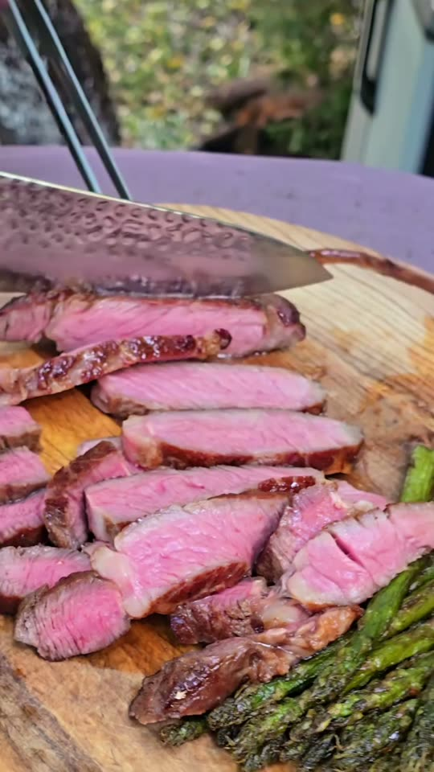
*Foto: cadru din [reelul Grill Mind](https://www.instagram.com/p/DRkLgnYiN5_/)*

> **Sursa:** aceasta este „partea a doua" a unui tutorial de la **Grill Mind**. Descrierea nu conține rețeta, așa că am luat metoda din **videoclip**: am descărcat reelul public, am transcris vorbirea în română cu un instrument local de recunoaștere vocală (câteva cuvinte pot fi auzite greșit) și am citit cadrele; fișierul video este șters. Unde videoclipul nu dă o cantitate, am completat-o de pe site-uri românești și am marcat *(obișnuit)*. Partea întâi (sărarea la sec) e un videoclip separat pe care nu l-am văzut.

## Povestea
- **Originile:** *Antricot* vine din francezul *entrecôte*, „între coaste": carne din regiunea coastelor animalului ([DEX](https://dexonline.ro/definitie/antricot)). Friptura din reel este un *Deluxe Antricot de vită Uruguay* de la Lidl, la reducere cu 16,99 lei la 100 g (de la 18,50), după eticheta de pe raft din poza de copertă.

  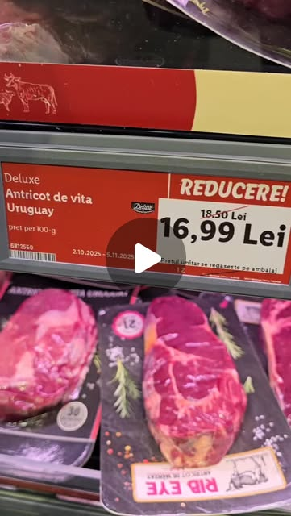
  *Produsul din reel, la raft · Foto: [reelul Grill Mind](https://www.instagram.com/p/DRkLgnYiN5_/)*

- **Cum a evoluat:** Reelul arată felul modern de a găti o friptură groasă: o sari **cu ore înainte** („dry brine"), o gătești **după temperatura din interior, nu după ceas** și o termini cu o **baie de unt fierbinte** (*basting*). Gustos spune să săreze fie cu cel puțin 40 de minute înainte, fie chiar înainte de gătit, niciodată în intervalul de 5–15 minute dintre ele ([Gustos](https://www.gustos.ro/sfaturi-culinare/cum-sa-gatesti-perfect-un-antricot-de-vita-ghid-complet-pentru-steak-ca-la-restaurant.html)).
- **Curiozitate:** Autorul avertizează că aparatul foto minte în privința culorii cărnii: aceeași friptură arată foarte diferit la lumina zilei și la lumina din bucătărie, așa că judecă gradul de gătire cu termometrul, nu cu ochiul.

## Sfaturile meșterului la grătar 🔥
*Am căutat surse de la bunici pentru acest preparat și nu am găsit, deci acestea sunt sfaturile autorului și ale site-urilor românești.*
- **Șterge friptura foarte bine, după sărarea la sec.** Sarea a scos apa la suprafață; orice umezeală rămasă blochează reacția de rumenire, deci o suprafață uscată dă o crustă mai bună. *Reelul.*
- **Lasă usturoiul în coajă până la baia de unt,** ca să nu se ardă; apoi zdrobește-l tare ca să-și lase aroma. *Reelul.*
- **Apasă friptura cu o greutate grea** pentru contact uniform cu tigaia fierbinte. *Reelul.*
- **Gătește după temperatură, nu după timp.** Autorul spune că e „împotriva gătirii după ceas", pentru că nu știi căldura reală a tigăii tale. *Reelul.*
- **Ține focul mic pentru unt,** altfel se arde și devine amar. *Reelul.*
- **Scoate friptura la 53–54 °C și mănâncă-o la 55–56 °C:** temperatura mai crește puțin în timpul odihnei. *Reelul.* Gustos pune medium-rare la cam 55 °C și medium la 60 °C.
- **Pune untul abia după ce s-a format crusta,** nu la început. *Confirmat* ([Gustos](https://www.gustos.ro/sfaturi-culinare/cum-sa-gatesti-perfect-un-antricot-de-vita-ghid-complet-pentru-steak-ca-la-restaurant.html)).
- **Sfatul unui comentator:** las-o la odihnă sub folie, cu rozmarinul, puțin unt din tigaie și poate usturoi. *Tradiție* (comentariu al unui spectator, nu al autorului).
- **Siguranță:** mânerul tigăii de fontă ajunge mult peste 100 °C, folosește o cârpă. *Reelul.*

**Porții** 2 · **Pregătire** 20 min · **Sărare la sec** 6 h · **Gătire** cam 20 min · **Mediu**

> **Înainte să începi:** sară friptura cu cam 6 ore înainte și las-o descoperită la frigider (pasul 1). Îți trebuie o tigaie de fontă, o presă sau greutate grea, un termometru cu sondă și, ideal, un termometru cu infraroșu.

## Pregătirea ingredientelor
- [ ] Friptura sărată la sec și gata (pasul 1)
- [ ] 2–3 căței de usturoi, **în coajă**
- [ ] 1–2 crenguțe de rozmarin (sau cimbru, sau nimic)
- [ ] 30–50 g unt, tăiat bucăți *(obișnuit)*
- [ ] Un mănunchi de sparanghel (cam 200 g, curățat) *(obișnuit)*
- [ ] Șervețele de hârtie, clești, o lingură mare, o farfurie și o cârpă pentru mânerul fierbinte

## Ingrediente
- [ ] 1 antricot gros, cam 450 g și de cel puțin 2–2,5 cm grosime
- [ ] Sare grosieră: **1% din greutatea cărnii**, cam 5 g la 500 g *(obișnuit)*
- [ ] 2–3 căței de usturoi, necurățați *(obișnuit)*
- [ ] 1–2 crenguțe de rozmarin
- [ ] 30–50 g unt *(obișnuit)*
- [ ] Cam 200 g sparanghel *(obișnuit)*

## Pași
**Cu ore înainte (partea întâi din reel)**
1. [ ] **Sărarea la sec:** sară friptura peste tot cu **cam 5 g sare grosieră (1% din greutatea ei)** și las-o descoperită pe un grătar, la frigider. *Reelul spune cam 6 ore; cantitatea de sare vine de la [csid.ro](https://www.csid.ro/diete/retete-culinare/cata-sare-trebuie-pusa-pe-carne-daca-faci-friptura-care-este-raportul-ideal-recomandat-de-chefi-21197098/).*
   ⏱ **6 h** — *suprafața pare umedă; sarea scoate apa.*

**Gătirea**
2. [ ] Scoate friptura și **șterge-o foarte bine** cu șervețele de hârtie, până nu mai rămâne apă la suprafață.

   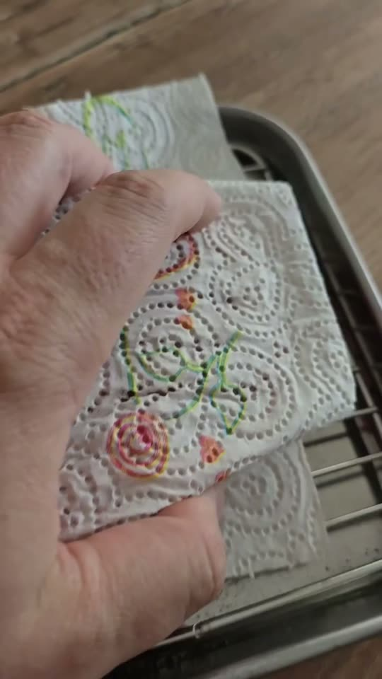
   *Scoate fiecare strop de umezeală · Foto: [reelul Grill Mind](https://www.instagram.com/p/DRkLgnYiN5_/)*

3. [ ] Încinge **tigaia de fontă** până e **foarte, foarte fierbinte: cel puțin 200 °C**. Autorul folosește arzătorul ceramic al unui grătar pe gaz și verifică tigaia cu un termometru cu infraroșu.

   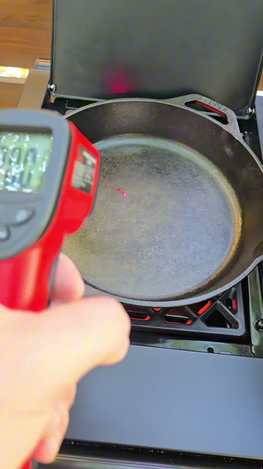
   *Verifică tigaia: 200 °C sau mai mult · Foto: [reelul Grill Mind](https://www.instagram.com/p/DRkLgnYiN5_/)*

4. [ ] Începe cu **partea grasă în jos**, ținând friptura cu cleștii, până se topește grăsimea și tigaia e unsă. *Treci mai departe când grăsimea s-a topit și e translucidă.*

   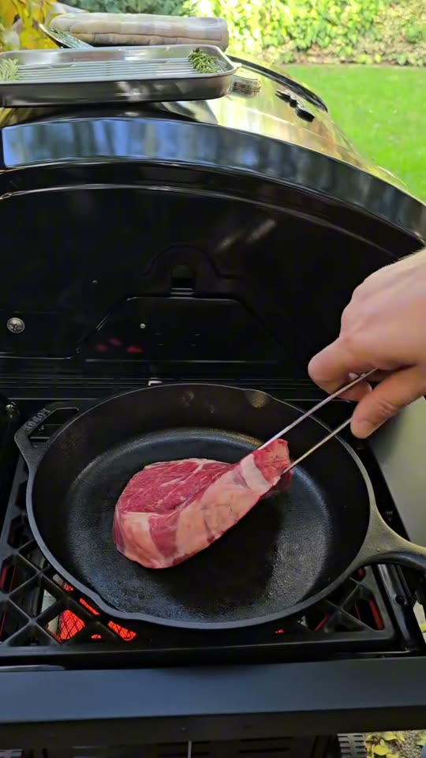
   *Topește mai întâi grăsimea · Foto: [reelul Grill Mind](https://www.instagram.com/p/DRkLgnYiN5_/)*

5. [ ] Așază friptura plat în tigaie și pune **presa grea** deasupra, pentru contact uniform.

   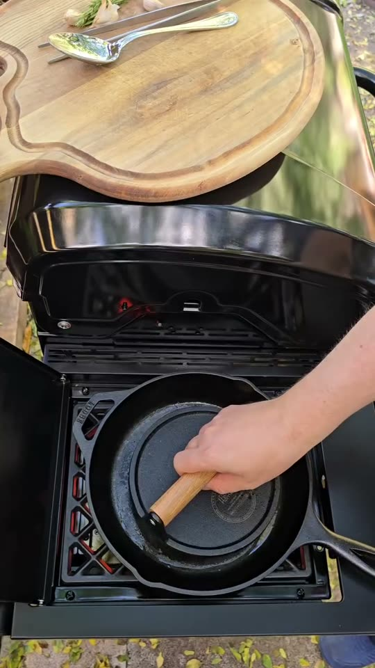
   *Presa lipește friptura de tigaie · Foto: [reelul Grill Mind](https://www.instagram.com/p/DRkLgnYiN5_/)*

   ⏱ **2 min** — *„să zicem 2 minute", spune autorul, nu o regulă.*
6. [ ] **Întoarce.** Crusta trebuie să fie deja caramelizată uniform. Pune presa la loc.

   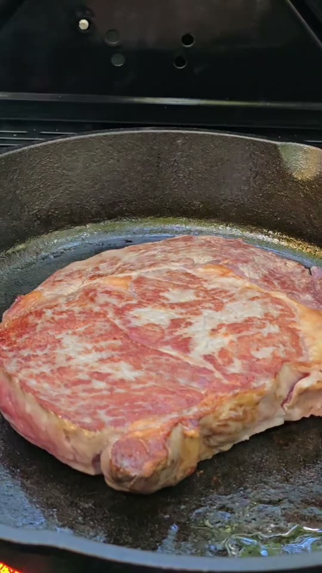
   *Crustă uniformă, bine rumenită · Foto: [reelul Grill Mind](https://www.instagram.com/p/DRkLgnYiN5_/)*

   ⏱ **2 min** — *atenție la mâner: e mult peste 100 °C.*
7. [ ] **Întoarce din nou și măsoară temperatura din interior** cu sonda.

   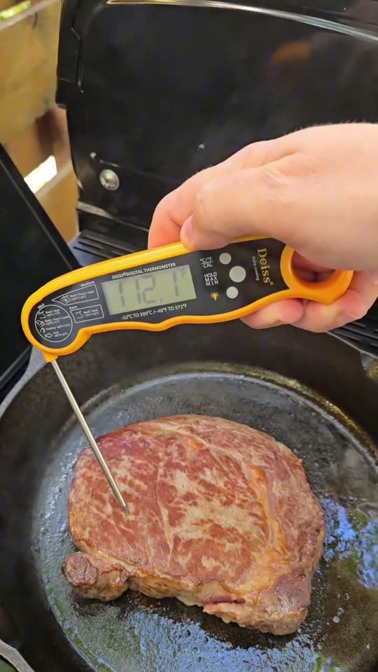
   *Gătește după temperatură, nu după ceas · Foto: [reelul Grill Mind](https://www.instagram.com/p/DRkLgnYiN5_/)*

8. [ ] Când interiorul trece de **32 °C (90 °F)**, dă focul la **mic**. Zdrobește tare **2–3 căței de usturoi** necurățați și pune-i cu **30–50 g unt** și **1–2 crenguțe de rozmarin**.

   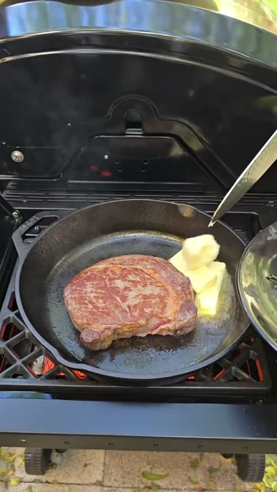
   *Intră untul, scade focul · Foto: [reelul Grill Mind](https://www.instagram.com/p/DRkLgnYiN5_/)*

9. [ ] **Basting:** înclină tigaia și toarnă continuu untul fierbinte și aromat peste friptură până când interiorul ajunge la **53–54 °C (130 °F)**. *După temperatură, nu după timp.* Scoate friptura.

   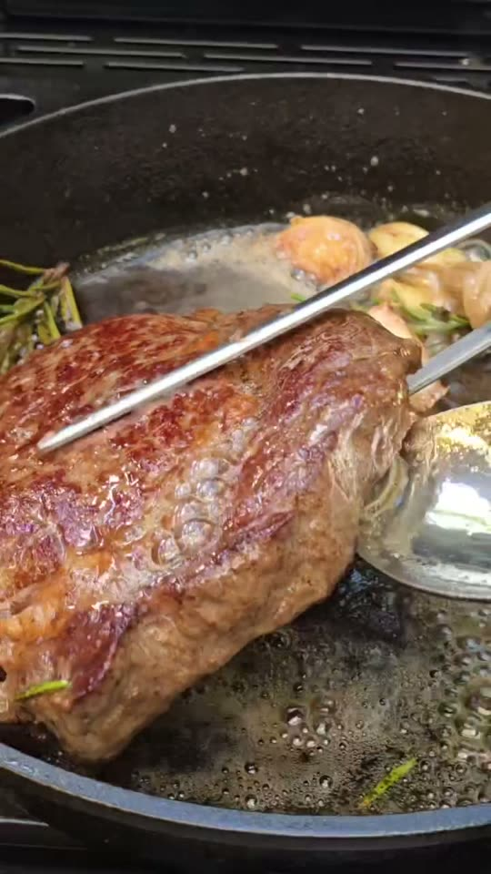
   *Baia de unt fierbinte · Foto: [reelul Grill Mind](https://www.instagram.com/p/DRkLgnYiN5_/)*

10. [ ] Lasă friptura la **odihnă** pe o farfurie. Autorul numește pasul „foarte important", dar nu dă un timp.
    ⏱ **7 min** — *5–7 minute după [Gustos](https://www.gustos.ro/sfaturi-culinare/cum-sa-gatesti-perfect-un-antricot-de-vita-ghid-complet-pentru-steak-ca-la-restaurant.html), acoperită lejer cu folie.* *(reelul nu dă un timp)*
11. [ ] Între timp gătește **sparanghelul** în aceeași grăsime ca friptura, întorcându-l des.
    ⏱ **3 min** — *verde aprins și ușor rumenit.* *(obișnuit; reelul nu dă un timp)*

    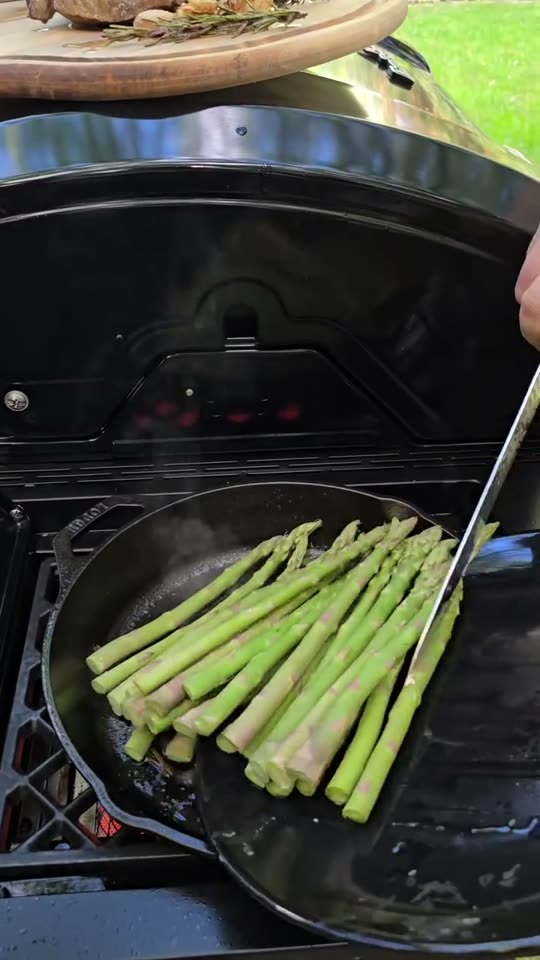
    *Aceeași tigaie, aceeași grăsime · Foto: [reelul Grill Mind](https://www.instagram.com/p/DRkLgnYiN5_/)*

12. [ ] **Taie** friptura în sens transversal pe fibră, felii de cam 1–1,5 cm ([Gustos](https://www.gustos.ro/sfaturi-culinare/cum-sa-gatesti-perfect-un-antricot-de-vita-ghid-complet-pentru-steak-ca-la-restaurant.html)), și servește cu sparanghelul. Rezultatul din reel este cam **medium**.

## Cronometre – pe scurt
| Pas | Timp | Ce urmărești |
|---|---|---|
| Sărare la sec | 6 h | Suprafață umedă, descoperită la frigider |
| Rumenire, partea 1 | 2 min | Crustă caramelizată uniform |
| Rumenire, partea 2 | 2 min | Apoi sonda în interior |
| Basting | după temperatură | Interior 53–54 °C |
| Odihnă | 7 min | Temperatura urcă la 55–56 °C |
| Sparanghel | 3 min | Verde aprins, ușor rumenit |

## Dacă ceva nu merge
- **Friptură cenușie, crustă slabă:** suprafața era umedă sau tigaia nu era destul de fierbinte. Șterge bine și încinge la 200 °C sau mai mult.
- **Unt ars și amar:** focul era prea mare. Pune untul abia după ce se formează crusta și scade focul.
- **Prea gătită:** scoate-o la 53–54 °C; mai crește câteva grade la odihnă.
- **Prea sărată:** rămâi la cam 1% din greutatea cărnii.
- **Carne tare:** las-o la odihnă și taie-o transversal pe fibră.

## Servire, păstrare, reîncălzire
Se servește imediat cu sparanghelul și zeama din tigaie. Friptura rămasă se ține 2 zile la frigider; mănânc-o rece, felii, sau încălzește-o foarte scurt ca să nu se gătească în plus.

---

## Listă de cumpărături
- [ ] **Carne:** 1 antricot gros, cam 450 g
- [ ] **Legume:** sparanghel (cam 200 g), usturoi, rozmarin
- [ ] **Lactate:** unt (50 g)
- [ ] **Cămară:** sare grosieră

## Echipament
Tigaie de fontă, presă sau greutate grea, termometru cu sondă (unul cu infraroșu e un bonus), clești, o lingură mare, șervețele de hârtie.

## Surse comparate
Metoda este [reelul Grill Mind](https://www.instagram.com/p/DRkLgnYiN5_/), luată din vorbire și din cadre, pentru că descrierea nu conține rețeta. Verificări românești: [DEX](https://dexonline.ro/definitie/antricot) (originea cuvântului), [csid.ro](https://www.csid.ro/diete/retete-culinare/cata-sare-trebuie-pusa-pe-carne-daca-faci-friptura-care-este-raportul-ideal-recomandat-de-chefi-21197098/) (sare 1% din greutatea cărnii), [Gustos](https://www.gustos.ro/sfaturi-culinare/cum-sa-gatesti-perfect-un-antricot-de-vita-ghid-complet-pentru-steak-ca-la-restaurant.html) (unt 30–50 g, odihnă 5–7 min, tăiere, temperaturi de gătire). Transcrierea vine de la un instrument automat, deci temperaturile și timpii au fost verificați cu ce am văzut în cadre. Sfatul cu folia vine din comentariul unui spectator.

## Variante
- **Cimbru în loc de rozmarin,** sau fără plante aromatice (sugestia autorului).
- **Gătește la gradul dorit** cu temperaturile din Gustos: rare 50 °C, medium-rare 55 °C, medium 60 °C, medium-well 65 °C. Scoate cu cam 2 °C mai devreme.
