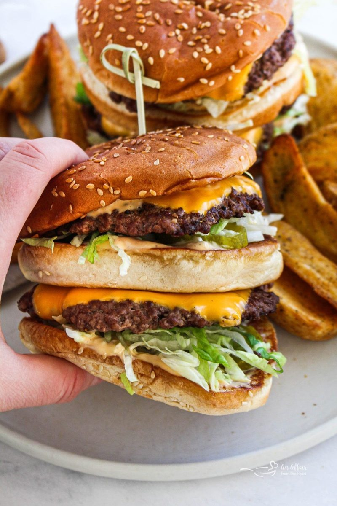

# Double-Layer Burger, Big Mac Style 🍔
*Two thin patties, three-part sesame bun, special sauce and very finely minced onion*

*Photo: [An Affair from the Heart](https://anaffairfromtheheart.com/copycat-mcdonalds-big-mac/)*

> **The sauce:** this burger uses our own [Burger Sauce](recipe:burger-sauce). Make it first (it needs an hour in the fridge) and use its **Big Mac–style variant (no ketchup)**.

## The story
- **Origins:** The Big Mac was created by Jim Delligatti, a McDonald's franchisee near Pittsburgh. It debuted on **April 22, 1967** at his Uniontown, Pennsylvania restaurant for 45 cents and went on McDonald's menus across the US in 1968. He later said he copied the double-decker idea from the Big Boy burger, sold since the 1940s ([Wikipedia](https://en.wikipedia.org/wiki/Big_Mac)).
- **How it evolved:** A **1974 jingle** made the build famous: *"two all-beef patties, special sauce, lettuce, cheese, pickles, onions, on a sesame seed bun"* ([CopyKat](https://copykat.com/copycat-mcdonalds-big-mac-recipe/)). McDonald's own page still lists seven components: the Big Mac bun, 100% beef patty, shredded lettuce, Big Mac sauce, pasteurized process American cheese, pickle slices and onions ([McDonald's](https://www.mcdonalds.com/us/en-us/product/big-mac.html)).
- **Fun fact:** The onions are the detail home cooks miss. CopyKat says real Big Macs use **dehydrated onions rehydrated in warm water**, not chopped fresh ones; that is the author's claim, which McDonald's page does not state. Either way, the onion is minced tiny, so it sits in every bite instead of in slices.

## Burger-joint tips 🍔
*There is no grandma tradition for this burger, so these are tips from US recipe sites.*
- **Mince the onion very fine** instead of slicing it, so you get a little in every bite. *Confirmed* ([CopyKat](https://copykat.com/copycat-mcdonalds-big-mac-recipe/), [An Affair from the Heart](https://anaffairfromtheheart.com/copycat-mcdonalds-big-mac/)).
- **Toast the middle bun on both sides,** separately, so it keeps the stack firm and doesn't go soggy. *Confirmed* (CopyKat).
- **Shape the patties a bit wider than the bun and press a small dimple in the middle:** they shrink when cooking and the dimple stops them bulging. *Confirmed* (CopyKat).
- **Keep the patties thin and cook them hot:** a 350 °F (177 °C) griddle, 3–4 minutes per side. *Confirmed* (CopyKat).
- **Make the special sauce ahead:** a few hours, or overnight (An Affair from the Heart chills hers 8–24 hours). *Confirmed.*
- **Use iceberg lettuce, shredded,** and American cheese melted over the patty. *Tradition* (CopyKat, Six Sisters' Stuff).
- **Toast the buns in butter like a grilled cheese.** *Confirmed* (An Affair from the Heart, CopyKat).

**Makes** 4 burgers · **Prep** 15 min · **Cook** 15 min · **Easy**

> **Before you start:** make the [Burger Sauce](recipe:burger-sauce) at least **1 hour ahead** (½ cup / 8 tbsp is needed). You need 8 sesame seed buns.

## Mise en place
- [ ] Burger Sauce made and chilled (**8 tbsp**)
- [ ] **545 g (1.2 lb) ground chuck**, cold
- [ ] **1 small white onion**, minced **very fine** (you need **4 tbsp**)
- [ ] **2 cups** iceberg lettuce, finely shredded
- [ ] **12 dill pickle slices**, patted dry
- [ ] **4 slices American cheese**
- [ ] **1 tbsp butter**, softened
- [ ] **8 sesame seed buns**, split

## Ingredients (4 burgers)
**Patties**
- [ ] 545 g (1.2 lb) ground chuck
- [ ] ½ tsp salt, plus a dash on the griddle
- [ ] ¼ tsp black pepper, plus a dash on the griddle

**Buns and fillings**
- [ ] 8 sesame seed buns: 4 whole (for top and bottom) plus 4 extra **bottom** halves for the middle layer
- [ ] 1 tbsp softened butter
- [ ] 8 tbsp (½ cup) [Burger Sauce](recipe:burger-sauce)
- [ ] 4 tbsp very finely minced white onion
- [ ] 2 cups shredded iceberg lettuce
- [ ] 4 slices American cheese
- [ ] 12 dill pickle slices

## Steps
1. [ ] **Sauce:** make the [Burger Sauce](recipe:burger-sauce) and chill it.
   ⏱ **1 h** — *at least; flavours blend and the sauce thickens.*
2. [ ] **Prep the toppings:** mince **1 small white onion** as fine as you can (**4 tbsp**), shred **2 cups** iceberg lettuce, pat **12 pickle slices** dry and unwrap **4 cheese slices**.
3. [ ] **Shape:** divide **545 g ground chuck** into **8 thin patties (about 68 g each)**, slightly wider than the bun. Press a small **dimple** in the centre of each.
4. [ ] **Heat** a griddle or large skillet to **350 °F (177 °C)**. Season the patties with **½ tsp salt** and **¼ tsp pepper**, then cook them.
   ⏱ **4 min** — *first side, until a brown crust forms; add a dash more salt and pepper as they cook.* *(CopyKat: 3–4 min)*
5. [ ] **Flip** and cook the second side until the juices run clear (**160 °F / 71 °C** inside). Lay **1 cheese slice on 4 of the patties** for the last minute so it melts.
   ⏱ **4 min** — *juices run clear.* *(CopyKat: 3–4 min)*
6. [ ] **Toast the buns:** spread **1 tbsp softened butter** on the cut sides of all 8 buns and toast them on the griddle until golden. **Flip the 4 middle buns** and toast both sides.
   ⏱ **2 min** — *golden brown.* *(typical)*
7. [ ] **Build the bottom layer:** on each **bottom bun** put **1 tbsp sauce**, **½ tbsp minced onion**, **¼ cup shredded lettuce** and a **cheese-topped patty**.
8. [ ] **Add the middle bun:** place a **middle bun** on top. Add **1 tbsp sauce**, **½ tbsp minced onion**, **¼ cup shredded lettuce** and a **second patty**, then **3 pickle slices**.
9. [ ] **Top** with the **top bun** and serve straight away, while it is hot.

## Timer cheat-sheet
| Step | Time | Look for |
|---|---|---|
| Sauce | 1 h+ | Chilled and thick |
| Patty, 1st side | 3–4 min | Brown crust |
| Patty, 2nd side | 3–4 min | Juices run clear, 160 °F (71 °C) |
| Toast buns | about 2 min | Golden |

## If it goes wrong
- **Soggy middle:** toast the middle bun on both sides and add the sauce just before closing.
- **Patties puff up:** press a dimple in the centre before cooking.
- **Patties too small after cooking:** shape them wider than the bun; they shrink.
- **Dry patties:** don't press them while cooking, and cook only 3–4 minutes per side.
- **Onion too strong:** mince it finer and use only ½ tbsp per layer.

## Serve, store, reheat
Serve at once with fries or wedges. Keep the components separately in airtight containers for up to 3 days; cooked patties (no toppings) freeze for up to 2 months. Reheat patties in a skillet over medium-low heat with 1 tbsp water and a lid for 1–2 minutes per side, then build the burger. Don't freeze an assembled burger ([CopyKat](https://copykat.com/copycat-mcdonalds-big-mac-recipe/)).

---

## Grocery list
- [ ] **Meat:** ground chuck 545 g
- [ ] **Bakery:** 8 sesame seed hamburger buns
- [ ] **Produce:** 1 small white onion, iceberg lettuce, dill pickle slices
- [ ] **Dairy:** 4 slices American cheese, 1 tbsp butter
- [ ] **Pantry:** salt, black pepper, and the ingredients of the [Burger Sauce](recipe:burger-sauce)

## Equipment
Griddle or large skillet, spatula, a knife for mincing the onion very fine, a cooking thermometer (optional).

## Sources compared
Base: [CopyKat](https://copykat.com/copycat-mcdonalds-big-mac-recipe/) (4.99 from 52 votes; read in a normal browser, as the site blocks automated tools). Cross-checks: [An Affair from the Heart](https://anaffairfromtheheart.com/copycat-mcdonalds-big-mac/) (4.59 from 132 votes) and [Six Sisters' Stuff](https://www.sixsistersstuff.com/recipe/homemade-copycat-big-mac-recipe/). The official build is from [McDonald's US](https://www.mcdonalds.com/us/en-us/product/big-mac.html) (also read in a normal browser).

| | Beef | Patties | Sauce | Onion |
|---|---|---|---|---|
| CopyKat | 1½ lb | 10 (about 68 g each), 5 burgers | ¼ cup for 5 burgers | 1 tbsp per burger |
| An Affair from the Heart | 2 lb | 12 thin, 6 burgers (about 75 g each) | sauce on every bun | minced, no amount |
| Six Sisters' Stuff | 2 lb | 8 (113 g each), 4 burgers | on the bottom and middle layers | only 1 tbsp inside the sauce, none in the stack |

I followed CopyKat for the patty size (about 136 g of beef per burger) and the 350 °F griddle, because it is the thinnest and closest to the original. CopyKat's introduction says the patties are 1.6 oz (45 g) each, which would need only 1 lb for 10 patties, but its own ingredient card lists 1½ lb. I used the card. The 1.6 oz figure is the author's claim; McDonald's page gives no weight. Sauce amounts differ a lot, so I used 2 tbsp per burger, between CopyKat's less than 1 tbsp and An Affair's roughly 3 tbsp. Fox Valley Foodie and AmazingRibs were blocked by bot checks, so I did not use them. For the sauce itself see [Burger Sauce](recipe:burger-sauce).

## Variants
- **Classic one-patty version:** CopyKat suggests skipping the middle bun and making one larger patty, built like a regular burger with all the toppings (smash-style, or with seasoned salt).
- **Rehydrated onions:** use dried minced onion soaked in warm water until soft, then drained, instead of fresh minced onion (CopyKat's claim about McDonald's).
- **Both patties with cheese:** An Affair from the Heart melts a slice on every patty.
- **Make-ahead patties:** freeze cooked patties in a single layer for up to 2 months.
