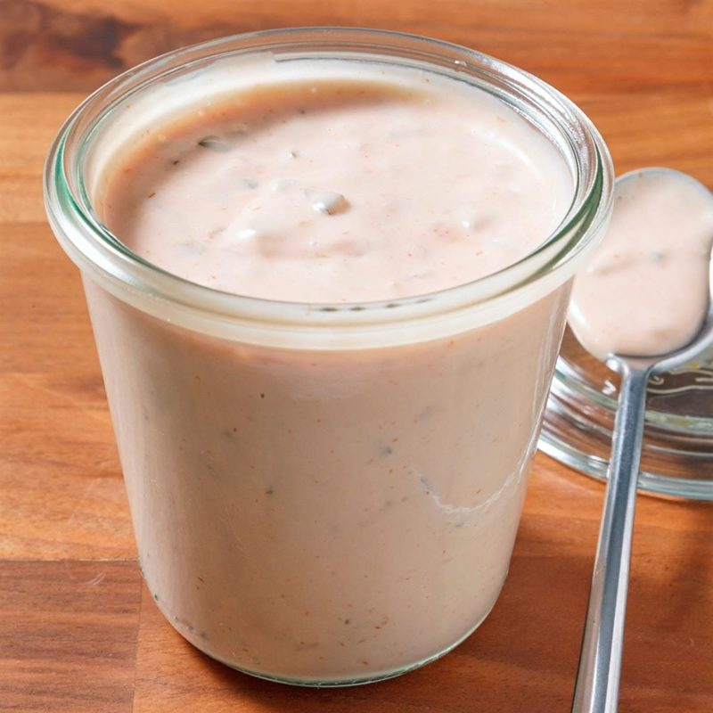
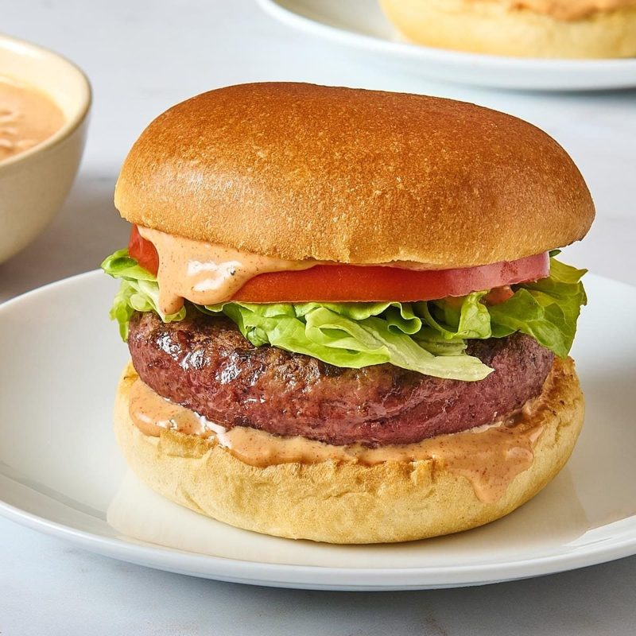

# Burger Sauce (the "Special Sauce") 🍔
*The creamy, tangy, pink sauce behind the Big Mac, In-N-Out's "spread" and a hundred burger joints*

*Photo: [Taste of Home](https://www.tasteofhome.com/recipes/copycat-in-n-out-sauce/)*

## The story
- **Origins:** Every American "special sauce" descends from **Thousand Island dressing**, named after the Thousand Islands region on the St. Lawrence River. Nobody knows who invented it: the stories name a fishing guide's wife, Sophia LaLonde, who made it for shore dinners; the Waldorf-Astoria's Oscar Tschirky in 1894; or an evolution of French dressing. They all rest on oral tradition. The earliest printed mention is from **October 1912** in *The Kansas City Post*, and the earliest known recipe from November 1912 ([Wikipedia](https://en.wikipedia.org/wiki/Thousand_Island_dressing)).
- **How it evolved:** Jim Delligatti's **Big Mac** debuted on April 22, 1967 in Uniontown, Pennsylvania, for 45 cents, and went national in 1968. A 1974 jingle made "special sauce" famous ([Wikipedia](https://en.wikipedia.org/wiki/Big_Mac)). In 2012 McDonald's chef Dan Coudreaut revealed the ingredients on YouTube: mayonnaise, sweet pickle relish and yellow mustard, with vinegar, garlic powder, onion powder and paprika. He gave **no amounts**, and no ketchup. In-N-Out's "spread" is also said to be based on Thousand Island dressing.
- **Fun fact:** McDonald's has said the Big Mac sauce is not simply Thousand Island dressing ([The Kitchn](https://www.thekitchn.com/big-mac-sauce-266998), via a search summary; I could not open that page's text), yet Wikipedia calls it a variation of it. In 2018 McDonald's took the preservatives out of the sauce.

## Burger-joint tips 🍔
*Burger sauce has no grandma tradition that I could find, so these are tips from US recipe sites.*
- **Make it ahead.** Let it sit **at least an hour** so the flavours meld. *Confirmed* ([Taste of Home](https://www.tasteofhome.com/recipes/burger-sauce/) and [its In-N-Out copycat](https://www.tasteofhome.com/recipes/copycat-in-n-out-sauce/), which chills 1 hour). Another Taste of Home burger recipe says the sauce is even better after an **overnight** chill (search summary; I did not open that page).
- **Use full-fat mayonnaise** for a luscious, thick sauce; light mayo works but is thinner. *Tradition* (a copycat guide, via a search summary).
- **A little sugar balances the vinegar** and brings out the sweetness of the ketchup and relish. *Confirmed* (the four recipes I opened all use some).
- **A splash of pickle juice adds tang.** Apple cider vinegar plus a little sugar can stand in for sweet pickle juice. *Tradition* (search summary; [Tasty](https://tasty.co/recipe/in-n-out-copycat-sauce)).
- **For a thicker sauce use more mayo;** for a Thousand Island feel use more ketchup and relish. *Tradition* (search summary).
- **Smoked paprika adds depth** (Taste of Home uses it) while plain paprika gives the classic colour and mild flavour. *Variant.*
- **Big Mac style has no ketchup;** In-N-Out style has no mustard. Pick one family and stick to it (see variants).

**Makes** about ¾ cup (180 ml) · **Prep** 5 min · **Chill** 1 h · **Easy**

> **Before you start:** the sauce needs an hour in the fridge, so make it before you start the burgers.

## Mise en place
- [ ] ½ cup (120 ml) mayonnaise, full-fat
- [ ] 3 tbsp (45 ml) ketchup
- [ ] 2 tbsp (30 ml) sweet pickle relish
- [ ] 2 tsp yellow mustard
- [ ] 1 tsp white vinegar and 1 tsp sugar
- [ ] ½ tsp paprika, ¼ tsp garlic powder, ¼ tsp onion powder
- [ ] A small bowl, a whisk and a spoon

## Ingredients (about ¾ cup)
- [ ] ½ cup (120 ml, about 115 g) mayonnaise
- [ ] 3 tbsp (45 ml) ketchup
- [ ] 2 tbsp (30 ml) sweet pickle relish
- [ ] 2 tsp yellow mustard
- [ ] 1 tsp white vinegar
- [ ] 1 tsp sugar
- [ ] ½ tsp paprika (smoked, if you like)
- [ ] ¼ tsp garlic powder
- [ ] ¼ tsp onion powder
- [ ] Black pepper, a pinch
- [ ] Optional: a splash of sweet pickle juice, if you want more tang

## Steps
1. [ ] In a small bowl, combine **½ cup (120 ml) mayonnaise**, **3 tbsp ketchup**, **2 tbsp sweet pickle relish** and **2 tsp yellow mustard**.
2. [ ] Add **1 tsp white vinegar**, **1 tsp sugar**, **½ tsp paprika**, **¼ tsp garlic powder**, **¼ tsp onion powder** and a pinch of black pepper.
3. [ ] **Whisk** until smooth and evenly pink, with the relish evenly spread.
4. [ ] **Taste and adjust:** more mustard for sharpness, more relish or a pinch of sugar for sweetness, a splash of pickle juice for tang.
5. [ ] **Chill** in a covered container so the flavours meld.
   ⏱ **1 h** — *at least; overnight is even better.*
6. [ ] Spread about **1–2 tbsp** on each burger bun *(typical amount)* and serve.

   
   *Sauce on both buns · Photo: [Tasty](https://tasty.co/recipe/in-n-out-copycat-sauce)*

## Timer cheat-sheet
| Step | Time | Look for |
|---|---|---|
| Whisk | 1 min | Smooth, even pink colour |
| Chill | 1 h+ | Flavours blended, slightly thicker |

## If it goes wrong
- **Too sharp or sour:** more mayo, or a pinch of sugar.
- **Too sweet:** a little more mustard and a few drops of vinegar.
- **Too thin:** more mayo, or less pickle juice.
- **Flat taste:** a pinch of salt, more paprika or a bit more relish.
- **Not pink enough:** more ketchup (or paprika for a Big Mac–style colour).

## Serve, store, reheat
Serve cold on burgers, as a dip for fries or onion rings, or on sandwiches. It keeps **up to 1 week** in an airtight container in the fridge ([The Kitchn](https://www.thekitchn.com/big-mac-sauce-266998)). It contains mayonnaise, so keep it cold.

---

## Grocery list
- [ ] **Pantry:** mayonnaise (120 ml), ketchup (45 ml), sweet pickle relish (30 ml), yellow mustard, white vinegar, sugar, paprika, garlic powder, onion powder, black pepper

## Equipment
Small bowl, whisk, covered container.

## Sources compared
All sources are US sites, in English, the dish's native language. The amounts below are per ½ cup (120 ml) of mayonnaise, so they can be compared.

| Source | Ketchup | Relish | Mustard | Vinegar | Sugar |
|---|---|---|---|---|---|
| [Taste of Home, burger sauce](https://www.tasteofhome.com/recipes/burger-sauce/) | 3.2 tbsp | 0.8 tbsp pickles + 0.8 tbsp juice | 0.8 tbsp | 1.2 tsp | 1.2 tsp |
| [Taste of Home, In-N-Out copycat](https://www.tasteofhome.com/recipes/copycat-in-n-out-sauce/) | 3 tbsp | 2 tbsp | none | 1.5 tsp | 1.5 tsp |
| [Tasty, In-N-Out copycat](https://tasty.co/recipe/in-n-out-copycat-sauce) (4.7 from 137 ratings) | 4 tbsp | 2 tbsp | none | 1 tsp | 1 tsp |
| [The Kitchn, Big Mac copycat](https://www.thekitchn.com/big-mac-sauce-266998) | none | 1.3 tbsp | 2 tsp | ⅓ tsp | 1.3 tsp |

The medians gave my amounts: ketchup 3 tbsp, relish 2 tbsp, mustard 2 tsp, vinegar 1 tsp, sugar about 1 tsp. [Food Network's special burger sauce](https://www.foodnetwork.com/recipes/special-burger-sauce-3253748) blocked fetching; I only know from a search summary that it uses mayo, mustard, relish, ketchup, vinegar, garlic powder, onion powder and paprika. The 2012 McDonald's video gave no amounts at all, so every Big Mac "copycat" is someone's tested guess. History: [Wikipedia, Thousand Island dressing](https://en.wikipedia.org/wiki/Thousand_Island_dressing) and [Wikipedia, Big Mac](https://en.wikipedia.org/wiki/Big_Mac). Serious Eats and Bon Appétit could not be crawled. There are no step photos because this is a stir-together sauce; the two photos show the finished sauce and a burger.

## Variants
- **Big Mac style:** skip the ketchup, use ¾ cup mayo, 1 tbsp yellow mustard, 2 tbsp sweet relish, 2 tsp sugar, ½ tsp white wine vinegar, ½ tsp paprika, ¼ tsp each garlic and onion powder (The Kitchn's tested version).
- **In-N-Out "spread" style:** skip the mustard, spices and powders; ½ cup mayo, ¼ cup ketchup, 2 tbsp relish, 1 tsp sugar, 1 tsp white vinegar (Tasty).
- **Smoky:** use smoked paprika; Taste of Home uses 1 tbsp for 1¼ cups of mayo.
- **Thousand Island:** more ketchup and relish, and fold in chopped egg or onion (Wikipedia lists chopped egg, onion, pepper and olives as traditional add-ins).
