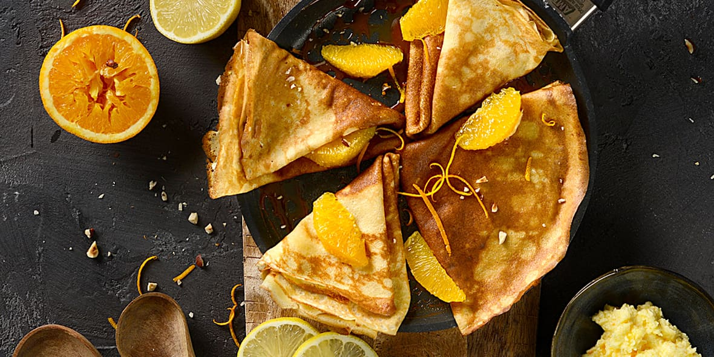
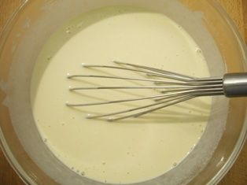
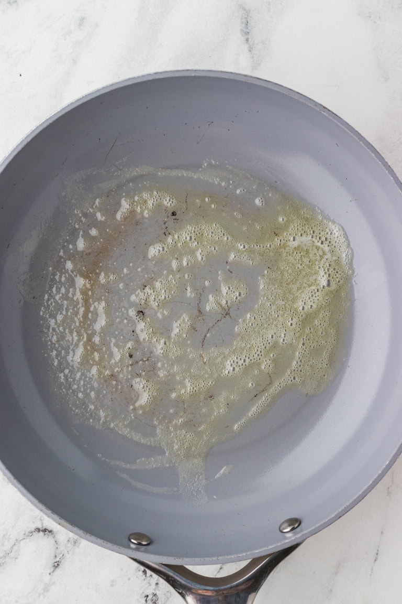
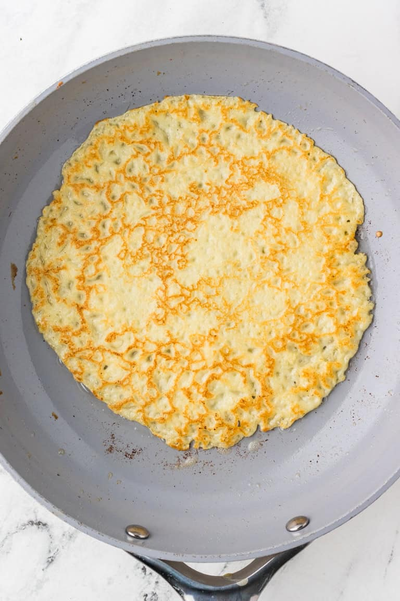

# Crêpes 🇫🇷

*Photo: [Meilleur du Chef](https://meilleurduchef.com/fr/dossier/pate-a-crepe.html)*

## The story
- **Origins:** Flat cakes of grain and water are ancient: Greeks and Romans cooked wheat, barley and millet cakes with honey or fresh cheese. The crêpe as we know it shows up in Brittany around the 13th century, after buckwheat, brought back from Asia by the Crusaders, took to the poor Breton soil. The buckwheat *galette* fed Bretons for centuries ([Dubocalalassiette](https://dubocalalassiette.fr/blog/le-roi-de-la-crepe/); dates vary by source).
- **How it evolved:** In Upper Brittany the split became the rule: **salty buckwheat = *galette*, thin sweet wheat = *crêpe***. The sweet crêpe became the festive one, tied to **La Chandeleur** (2 Feb, 40 days after Christmas), a Christian feast that landed on top of older Roman February celebrations where crêpes were already eaten.
- **Fun fact:** Tradition says to flip the crêpe with a gold coin (*louis d'or*) in your other hand to bring a year of prosperity ([La Libre](https://www.lalibre.be/lifestyle/food/2003/01/31/un-louis-dor-en-main-6L7JYLZXEVELDEPQEUL4RK4RQ4/)).

## Grandma's tips 👵
- **Eggs make them crisp and golden.** Annette, a Breton *mamie*, uses 250 g wheat + 50 g buckwheat flour, 125 g sugar and six eggs: three whole and three yolks. *Tradition* ([Brut](https://www.brut.media/fr/videos/la-recette-des-crepes-d-annette-mamie-bretonne-brut-food)). Want it richer? Add 1 extra yolk to this recipe.
- **Salted butter under the crêpe.** Slip a small piece under the crêpe at the end of cooking: *croustillant dehors, fondant au milieu*. *Tradition*, reported for one Breton grandmother (search summary; I didn't open the page).
- **Beurre noisette.** Brown the butter until it smells of hazelnuts, then whisk it into the batter. *Tradition.*
- **Beer in the batter.** An old regional habit, gives a light malty taste. *Myth:* it does **not** make the batter rise ([Démotivateur](https://www.demotivateur.fr/food/chandeleur-peut-on-ajouter-de-la-biere-dans-la-pate-a-crepes-23881)).
- **Ultra-fresh eggs, whole milk (even raw), T45/T55 flour.** *Confirmed by several sources.*
- **Water-drop test.** A drop that sizzles and evaporates means the pan is right, around 210 °C. *Confirmed.*

**Serves** 4 (~12 crêpes) · **Prep** 10 min · **Rest** 1 h · **Cook** 20 min · **Easy**

> **Before you start:** take the pan out, melt the butter, and (if cooking in the morning) take the batter out of the fridge.

## Mise en place
- [ ] Melt 50 g butter and let it cool slightly
- [ ] Measure 250 g flour, 40–60 g sugar, pinch of salt into a bowl
- [ ] Measure 500 ml milk
- [ ] Have ready: whisk, ladle, thin spatula, plate

## Ingredients
- [ ] 250 g plain flour
- [ ] 2 eggs
- [ ] 500 ml whole milk
- [ ] 50 g butter, melted (or 1 tbsp neutral oil)
- [ ] 40–60 g sugar
- [ ] 1 pinch salt
- [ ] Optional: 1 tbsp rum, 1 tsp vanilla, or orange blossom water
- [ ] Extra butter/oil for the pan

## Steps
1. [ ] Whisk flour, sugar and salt. Make a **well** in the middle.
2. [ ] Crack in the **2 eggs**. Whisk from the centre outward, adding **100 ml milk**.
3. [ ] Add the **rest of the milk** gradually, whisking until smooth. *Lumps? Blitz briefly with a blender.*
4. [ ] Stir in the melted butter and flavouring.
   ⏱ **Rest 1 h** (room temp) or overnight in the fridge. *Batter should be as thin as single cream.*

   
   *Batter should look like this · Photo: [Food Faith Fitness](https://www.foodfaithfitness.com/wprm_print/how-to-make-crepes)*

5. [ ] Heat the pan on **medium-high**. *Ready when a water drop sizzles and dances.*

   
   *Pan ready: thin film of melted butter · Photo: [Food Faith Fitness](https://www.foodfaithfitness.com/wprm_print/how-to-make-crepes)*

6. [ ] Grease lightly. Pour **1 ladle**, tilt the pan to spread thin.
   ⏱ **~1 min** — *edges golden and lifting, crêpe slides freely.*

   
   *Flip when it looks like this · Photo: [Food Faith Fitness](https://www.foodfaithfitness.com/wprm_print/how-to-make-crepes)*

7. [ ] Flip.
   ⏱ **20–30 s**
8. [ ] Stack on a plate over a pan of simmering water, or keep in an **80 °C oven**. Repeat; re-grease every 2–3 crêpes.

## Timer cheat-sheet
| Step | Time | Look for |
|---|---|---|
| Rest | 1 h+ | Thin as cream |
| Side 1 | ~1 min | Golden edges, slides |
| Side 2 | 20–30 s | Light spots |

## If it goes wrong
- **Tears:** batter too thin → add 1 egg + a spoonful of flour.
- **Rubbery:** pan too cool → raise the heat.
- **Burns before spreading:** pan too hot → lower the heat.
- **Too thick:** splash of milk.
- **First crêpe bad:** normal, it's the test.

## Serve, store, reheat
Lemon + sugar, Nutella, jam, honey, salted-butter caramel. Batter keeps 3–4 days in the fridge or freezes in a bottle. Reheat crêpes briefly in a dry pan.

---

## Grocery list
- [ ] **Dairy:** milk (500 ml), butter (~80 g), eggs (2)
- [ ] **Pantry:** flour (250 g), sugar, salt, vanilla/rum (optional)
- [ ] **Toppings:** lemon, Nutella, jam, honey

## Sources compared
Morbihan Tourisme (Breton, 1 h rest), Dubocalalassiette (4-3-2-1 ratio, hot pan), Meilleur du Chef (melted butter, blender for lumps), 24matins (snippet). Marmiton/Vikidia/750g not fetchable. Egg count differed (Meilleur du Chef: 6); I used the common ~2 per 250 g flour.
Also used for story & grandma's tips: Dubocalalassiette (history), La Libre (coin tradition), Brut Food (Annette), Démotivateur (beer myth).

## Variants
Breton galette (buckwheat, savoury); cider or rum in the batter.
