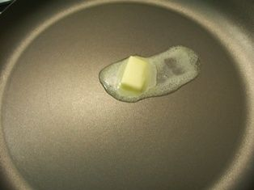
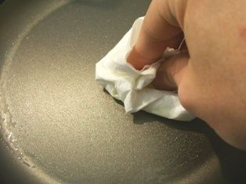
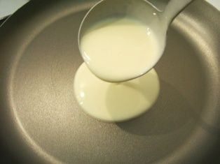
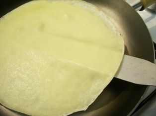
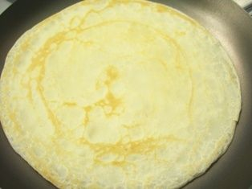

# Clătite franțuzești (*Crêpes*) 🇫🇷

*Photo: [Meilleur du Chef](https://meilleurduchef.com/fr/dossier/pate-a-crepe.html)*

## Povestea
- **Originile:** Turtele din cereale și apă sunt străvechi: grecii și romanii coceau turte din grâu, orz și mei, cu miere sau brânză proaspătă. Clătita așa cum o știm apare în Bretania pe la secolul al XIII-lea, după ce hrișca, adusă din Asia de cruciați, s-a prins pe pământul sărac al Bretaniei. *Galette*-ul de hrișcă a hrănit bretonii secole întregi ([Dubocalalassiette](https://dubocalalassiette.fr/blog/le-roi-de-la-crepe/); datele diferă între surse).
- **Cum a evoluat:** În Bretania de Sus regula a devenit: **hrișcă sărată = *galette*, grâu subțire și dulce = *crêpe***. Clătita dulce a devenit cea de sărbătoare, legată de **La Chandeleur** (2 februarie, la 40 de zile după Crăciun), o sărbătoare creștină ce s-a suprapus peste vechi sărbători romane din februarie, când se mâncau deja clătite.
- **Curiozitate:** Tradiția spune să întorci clătita cu o monedă de aur (*louis d'or*) în cealaltă mână, pentru un an prosper ([La Libre](https://www.lalibre.be/lifestyle/food/2003/01/31/un-louis-dor-en-main-6L7JYLZXEVELDEPQEUL4RK4RQ4/)).

## Sfaturile bunicii 👵
- **Ouăle le fac crocante și aurii.** Annette, o *mamie* bretonă, folosește 250 g făină de grâu + 50 g de hrișcă, 125 g zahăr și șase ouă: trei întregi și trei gălbenușuri. *Tradiție* ([Brut](https://www.brut.media/fr/videos/la-recette-des-crepes-d-annette-mamie-bretonne-brut-food)). Vrei mai bogate? Adaugă 1 gălbenuș în plus la rețeta asta.
- **Unt sărat sub clătită.** Strecoară un cubuleț la sfârșitul coacerii: *croustillant dehors, fondant au milieu* (crocant pe-afară, topit la mijloc). *Tradiție*, raportată pentru o bunică bretonă (rezumat din căutare; nu am deschis pagina).
- **Beurre noisette (unt de alună).** Rumenește untul până miroase a alune, apoi amestecă-l în aluat. *Tradiție.*
- **Bere în aluat.** Obicei regional vechi, dă un gust ușor de malț. *Mit:* **nu** face aluatul să crească ([Démotivateur](https://www.demotivateur.fr/food/chandeleur-peut-on-ajouter-de-la-biere-dans-la-pate-a-crepes-23881)).
- **Ouă foarte proaspete, lapte integral (chiar crud), făină T45/T55.** *Confirmat de mai multe surse.*
- **Testul picăturii de apă.** Dacă sfârâie și se evaporă, tigaia e bună, cam 210 °C. *Confirmat.*

**Porții** 4 (~12 clătite) · **Pregătire** 10 min · **Odihnă** 1 h · **Gătire** 20 min · **Ușor**

> **Înainte să începi:** scoate tigaia, topește untul și (dacă gătești dimineața) scoate aluatul din frigider.

## Pregătirea ingredientelor
- [ ] Topește 50 g unt și lasă-l să se răcească puțin
- [ ] Măsoară 250 g făină, 40–60 g zahăr și un praf de sare într-un bol
- [ ] Măsoară 500 ml lapte
- [ ] Pregătește: tel, polonic, spatulă subțire, o farfurie

## Ingrediente
- [ ] 250 g făină albă
- [ ] 3 ouă
- [ ] 500 ml lapte integral
- [ ] 50 g unt topit (sau 1 lingură ulei neutru)
- [ ] 40–60 g zahăr
- [ ] 1 praf de sare
- [ ] Aromă, **alege una**: 1 lingură rom **sau** 1 linguriță extract de vanilie (sau sari peste)
- [ ] Unt/ulei suplimentar pentru tigaie

## Pași
1. [ ] Într-un bol mare amestecă **250 g făină**, **40–60 g zahăr** și **1 praf de sare**. Fă o **adâncitură** în mijloc.
2. [ ] Sparge **3 ouă** în adâncitură. Amestecă cu telul dinspre centru spre margini, adăugând **100 ml lapte** (din cei 500 ml).
3. [ ] Adaugă **restul de 400 ml lapte** puțin câte puțin, amestecând până se omogenizează. *Prea mult lapte deodată face cocoloașe. Tot ai cocoloașe? Strecoară printr-o sită fină sau dă scurt cu blenderul.*
4. [ ] Adaugă **50 g unt topit** și aroma: **1 lingură rom SAU 1 linguriță extract de vanilie**. *Alege una, nu amândouă, sau sari peste.*
   ⏱ **Odihnă 1 h** (la temperatura camerei) sau peste noapte la frigider. *Aluatul trebuie să fie fluid ca smântâna lichidă.*

   
   *Așa trebuie să arate aluatul · Foto: [Le Sot L'y Laisse](https://lesotlylaisse.over-blog.com/article-realiser-une-pate-a-crepes-et-cuire-des-crepes-en-images-60285226.html)*

5. [ ] Încinge tigaia la **foc mediu** și topește un cubuleț de unt. *E gata când o picătură de apă sfârâie și dansează.*

   
   *Topește puțin unt · Foto: [Le Sot L'y Laisse](https://lesotlylaisse.over-blog.com/article-realiser-une-pate-a-crepes-et-cuire-des-crepes-en-images-60285226.html)*

6. [ ] Șterge excesul de unt cu un șervet de hârtie (păstrează hârtia ca să ungi tigaia din nou la fiecare 2–3 clătite).

   
   *Las-o doar cu o peliculă subțire · Foto: [Le Sot L'y Laisse](https://lesotlylaisse.over-blog.com/article-realiser-une-pate-a-crepes-et-cuire-des-crepes-en-images-60285226.html)*

7. [ ] Toarnă **cam 70 ml (1 polonic)** de aluat dintr-o dată și învârte tigaia ca să se întindă subțire.

   
   *Un polonic, turnat odată · Foto: [Le Sot L'y Laisse](https://lesotlylaisse.over-blog.com/article-realiser-une-pate-a-crepes-et-cuire-des-crepes-en-images-60285226.html)*

   ⏱ **90 s** (1 min 30) — *suprafața mată, marginile se desprind; strecoară o spatulă pe sub margine.*

   
   *Întoarce acum · Foto: [Le Sot L'y Laisse](https://lesotlylaisse.over-blog.com/article-realiser-une-pate-a-crepes-et-cuire-des-crepes-en-images-60285226.html)*

8. [ ] Întoarce clătita.
   ⏱ **30 s** — *doar până apar pete aurii.*

   
   *Gata când arată așa · Foto: [Le Sot L'y Laisse](https://lesotlylaisse.over-blog.com/article-realiser-une-pate-a-crepes-et-cuire-des-crepes-en-images-60285226.html)*

9. [ ] Așază clătitele pe o farfurie deasupra unei oale cu apă fierbinte sau ține-le în cuptor la **80 °C**. Repetă cu restul aluatului (cam 12 clătite); unge tigaia din nou la fiecare 2–3 clătite.

## Cronometre – pe scurt
| Pas | Timp | Ce urmărești |
|---|---|---|
| Odihnă | 1 h+ | Subțire ca smântâna |
| Prima parte | 90 s | Suprafață mată, margini desprinse |
| A doua parte | 30 s | Pete aurii |

## Dacă ceva nu merge
- **Se rup:** aluat prea subțire → adaugă 1 ou și o lingură de făină.
- **Cocoloașe:** adaugă laptele treptat sau strecoară printr-o sită fină ([Le Sot L'y Laisse](https://lesotlylaisse.over-blog.com/article-realiser-une-pate-a-crepes-et-cuire-des-crepes-en-images-60285226.html), un profesor de gastronomie).
- **Gumoase:** tigaia e prea rece → mărește focul.
- **Se ard înainte să se întindă:** tigaia e prea fierbinte → micșorează focul.
- **Aluat prea gros:** adaugă puțin lapte.
- **Prima clătită iese rău:** e normal, e cea de probă.

## Servire, păstrare, reîncălzire
Cu lămâie și zahăr, Nutella, dulceață, miere sau caramel sărat cu unt. Aluatul se păstrează 3–4 zile la frigider sau poate fi congelat într-o sticlă, lăsând loc de dilatare. Reîncălzește clătitele scurt într-o tigaie uscată.

---

## Listă de cumpărături
- [ ] **Lactate:** lapte (500 ml), unt (~80 g), ouă (3)
- [ ] **Cămară:** făină (250 g), zahăr, sare, rom sau vanilie (la alegere)
- [ ] **Topping:** lămâie, Nutella, dulceață, miere

## Surse comparate
[Marmiton](https://www.marmiton.org/recettes/recette_pate-a-crepes_12372.aspx) (cel mai evaluat aluat francez: 1.017 recenzii, 4,3/5; 300 g făină, 3 ouă, 600 ml lapte, rom, 1 min 30 + 30 s), [Le Sot L'y Laisse](https://lesotlylaisse.over-blog.com/article-realiser-une-pate-a-crepes-et-cuire-des-crepes-en-images-60285226.html) (profesor de gastronomie: făină T55, 3 ouă, 500 ml lapte, odihnă 30 min, poze pas cu pas), Morbihan Tourisme (bretonă, odihnă 1 h), Dubocalalassiette (raport 4-3-2-1, tigaie fierbinte), Meilleur du Chef (unt topit, blender pentru cocoloașe), 24matins (doar fragment din căutare). Vikidia și 750g nu au putut fi accesate. Numărul de ouă variază (de la 1,75 la 6 la 250 g făină); mediana e cam 2,5, deci folosesc 3. Toate sursele și pozele sunt în limba franceză.
Folosite și pentru poveste și sfaturile bunicii: Dubocalalassiette (istorie), La Libre (moneda), Brut Food (Annette), Démotivateur (mitul cu berea).

## Variante
*Galette* bretonă (hrișcă, umplutură sărată); cidru sau rom în aluat.
