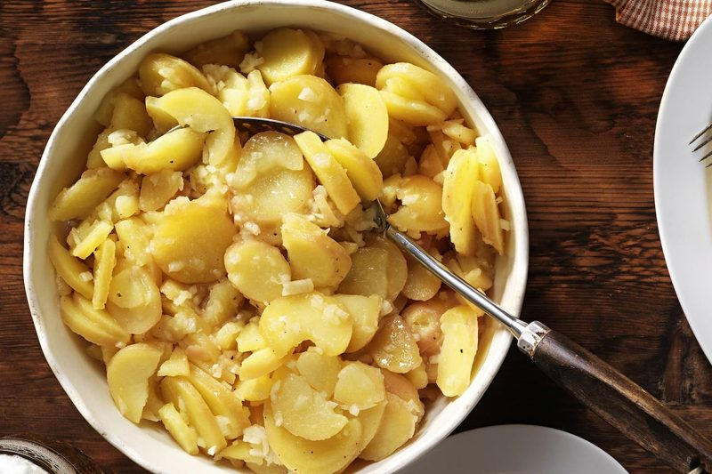

# Erdäpfelsalat (Viennese Potato Salad) 🇦🇹
*Erdäpfelsalat nach Wiener Art: warm potatoes in a hot beef-broth marinade*

*Photo: [Servus](https://www.servus.com/r/erdaepfelsalat) (Eisenhut & Mayer)*

## The story
- **Origins:** *Erdäpfel* is the Austrian (and south-German) word for potatoes, and the salad is old. The oldest German-language potato-salad recipe is by Wolf Helmhard von Hohberg (1682): *"Die indianischen Papas kocht und isst man warm oder auch überbrüht und geschält, kalt, mit Öl, Essig, Pfeffer und Saltz."* ([derStandard](https://www.derstandard.at/story/3000000238429/die-suche-nach-dem-perfekten-erdaepfelsalat)). The oldest known potato-salad recipe of all is said to be from the Austrian abbot Caspar Plautz (1621) (German Wikipedia, via search summary; I did not open the page).
- **How it evolved:** The Viennese way is a *"nasser"* (moist) salad: warm sliced potatoes are bound with hot **beef broth**, vinegar, oil, onion and tarragon mustard until it gets a creamy binding. There are also mayonnaise versions, which Austrian sites call a side for any meat or fish dish without sauce ([kochrezepte.at](https://www.kochrezepte.at/erdaepfelsalat-nach-wiener-art-rezept-1678)).
- **Fun fact:** Erdäpfelsalat is the classic side dish of the **Wiener Schnitzel**. In classic Viennese style, a handful or two of crisp *Vogerlsalat* (corn salad) is folded in just before serving (ichkoche, search summary).

## Austrian home-cook tips 👵
*I found no named grandmother for this dish, so these are tips from Austrian recipe sites.*
- **Boil the potatoes unpeeled and don't cook them too soft;** use waxy potatoes ("speckige", e.g. Kipfler). *Confirmed* ([Servus](https://www.servus.com/r/erdaepfelsalat), [Gute Küche](https://www.gutekueche.at/altwiener-kartoffelsalat-rezept-41120)).
- **Peel them hot and slice them while warm,** "messerrückendick" (about as thick as the back of a knife, 2–3 mm). *Confirmed* (Servus, Gute Küche, [kochrezepte.at](https://www.kochrezepte.at/erdaepfelsalat-nach-wiener-art-rezept-1678)).
- **Add the marinade while the potatoes are still warm,** so they soak it up. *Confirmed* (Servus, kochrezepte.at).
- **Blanch the onion in the hot soup first,** then strain and keep the soup. *Tradition* (Servus).
- **Stir until it gets a "sämige Bindung" (a creamy binding)**; the potato starch thickens the marinade. *Confirmed* (kochrezepte.at, [ichkoche](https://www.ichkoche.at/wiener-erdaepfelsalat-rezept-3154)).
- **Let it rest for about an hour, stirring now and then,** then taste again. *Confirmed* (Servus, Gute Küche).
- **A pinch of sugar belongs in it:** the sources include it, and a reader comment on ichkoche calls it essential. *Confirmed.*
- **Caraway is optional:** one ichkoche recipe suggests whole caraway, while a commenter says it does not belong in the authentic Viennese version. *Disputed.*

**Serves** 4 · **Prep** 20 min · **Cook** 25 min · **Rest** 1 h · **Easy**

> **Before you start:** make it at least an hour before eating. Bring the beef broth (*Rindsuppe*) up to hot, and have a big bowl ready for the potatoes.

## Mise en place
- [ ] Wash **800 g waxy potatoes**
- [ ] Finely chop **1 onion**
- [ ] Measure **250 ml** clear beef broth
- [ ] Measure **4 tbsp vinegar**, **4 tbsp sunflower oil**, **2 tsp tarragon mustard**, **1 tsp sugar**
- [ ] Chop **2 tbsp chives**

## Ingredients
- [ ] 800 g waxy potatoes (*speckige Erdäpfel*, e.g. Kipfler)
- [ ] 250 ml clear beef broth (*Rindsuppe*)
- [ ] 1 onion, finely chopped (about 60–80 g)
- [ ] 4 tbsp (about 60 ml) white wine vinegar
- [ ] 4 tbsp (about 60 ml) sunflower oil
- [ ] 2 tsp tarragon mustard (*Estragonsenf*)
- [ ] 1 tsp sugar
- [ ] Salt and pepper
- [ ] 2 tbsp chopped chives
- [ ] Optional: a handful of *Vogerlsalat* (corn salad), a pinch of whole caraway

## Steps
1. [ ] **Boil** the **800 g potatoes** in their skins in lightly salted water. *Don't cook them too soft.*
   ⏱ **25 min** — *a knife slides in easily, but they are still firm.* *(Gute Küche says about 25 minutes; ichkoche 15–20 for smaller potatoes.)*
2. [ ] **Peel** the potatoes while hot (hold them with a fork or a cloth) and cut them into slices **2–3 mm thick** into a big bowl. *Do it while they are warm.*
3. [ ] **Marinade:** heat **250 ml beef broth**, add the **chopped onion** and simmer for a short time. Take it off the heat and stir in **4 tbsp vinegar**, **2 tsp tarragon mustard**, **1 tsp sugar**, a pinch of salt and pepper.
   ⏱ **2 min** — *onion just softened.*
4. [ ] Pour the **hot marinade** over the **warm potato slices** and mix gently. Add **4 tbsp oil** and stir until the salad gets a creamy binding.
5. [ ] Leave to **rest**, stirring now and then, so the flavours blend.
   ⏱ **1 h** — *at room temperature.*
6. [ ] **Taste again** and adjust the vinegar, salt and sugar. Fold in **2 tbsp chives** (and a handful of *Vogerlsalat* just before serving, if you like). Serve with Wiener Schnitzel.

## Timer cheat-sheet
| Step | Time | Look for |
|---|---|---|
| Potatoes | 25 min | A knife slides in, still firm |
| Onion in broth | 2 min | Softened |
| Rest | 1 h | Creamy, juicy, tastes balanced |

## If it goes wrong
- **Dry:** add a little more warm broth.
- **Too watery:** next time use waxy potatoes, slice thin and rest for the full hour so the starch binds.
- **Mushy potatoes:** boil for less time; check with a knife after 20 minutes.
- **Flat taste:** more vinegar or salt, a little at a time, and a pinch of sugar.
- **Too sharp:** add a spoon of oil or a pinch of sugar.

## Serve, store, reheat
Serve at room temperature or slightly warm, with Wiener Schnitzel. It keeps for a day or two in the fridge; let it come back to room temperature and stir in a little warm broth if it has dried out.

---

## Grocery list
- [ ] **Produce:** waxy potatoes 800 g, 1 onion, chives (optional: corn salad)
- [ ] **Pantry:** clear beef broth (250 ml), white wine vinegar, sunflower oil, tarragon mustard, sugar, salt, pepper

## Equipment
Large pot, big mixing bowl, small pot for the marinade, sharp knife.

## Sources compared
Base: a median of three Austrian recipes. [Servus](https://www.servus.com/r/erdaepfelsalat) (1 kg Kipfler, only 125 ml hot soup, 2 tbsp vinegar, 3 tbsp oil; onion blanched in the soup), [kochrezepte.at](https://www.kochrezepte.at/erdaepfelsalat-nach-wiener-art-rezept-1678) (600 g potatoes, 250 ml soup, 4 tbsp vinegar, 6 tbsp oil, 1 tsp tarragon mustard) and [Gute Küche](https://www.gutekueche.at/altwiener-kartoffelsalat-rezept-41120) (800 g potatoes, 250 ml soup, 60 ml vinegar, 40 ml oil and 1 tbsp butter, 1 tbsp tarragon mustard, rest 1 h). The proportions differ a lot (from 125 to 417 ml of soup per kg), so I took 250 ml for 800 g, 4 tbsp vinegar and 4 tbsp oil and say to taste at the end. [ichkoche](https://www.ichkoche.at/wiener-erdaepfelsalat-rezept-3154) (4.8/5 from 489 reviews) gave the potato time, the caraway debate and the sugar comment; [derStandard](https://www.derstandard.at/story/3000000238429/die-suche-nach-dem-perfekten-erdaepfelsalat) gave the 1682 recipe (the article itself was behind a paywall). Falstaff blocked fetching. I found no German-language page with step-by-step photos, so there are none for this recipe.

## Variants
- **With mayonnaise:** Austrian recipes also fold in a dressing of mayonnaise, mustard and chives.
- **With sausage:** add finely chopped sausages (kochrezepte.at).
- **Without broth:** a drier version with only a little hot soup, as in the Servus recipe.
