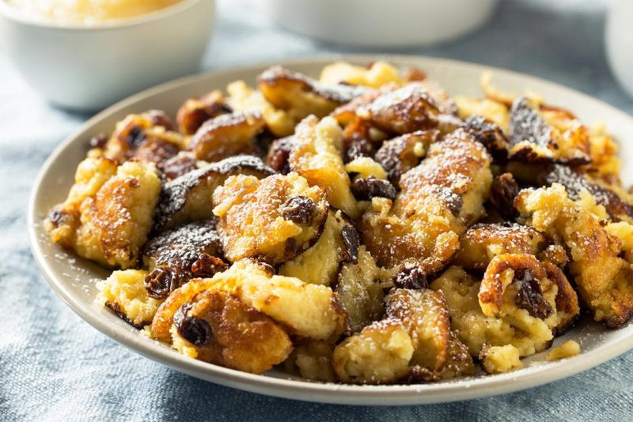
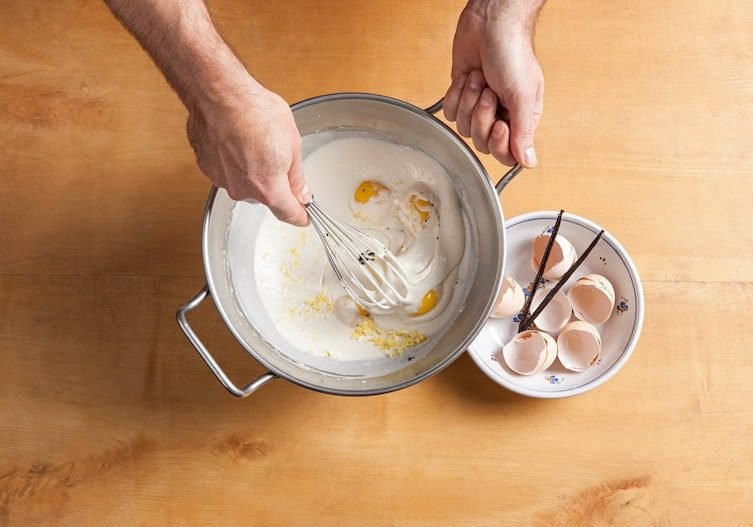
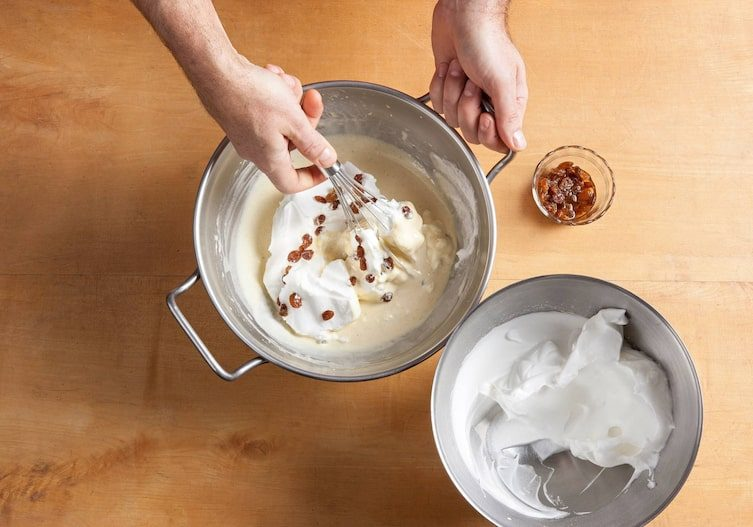
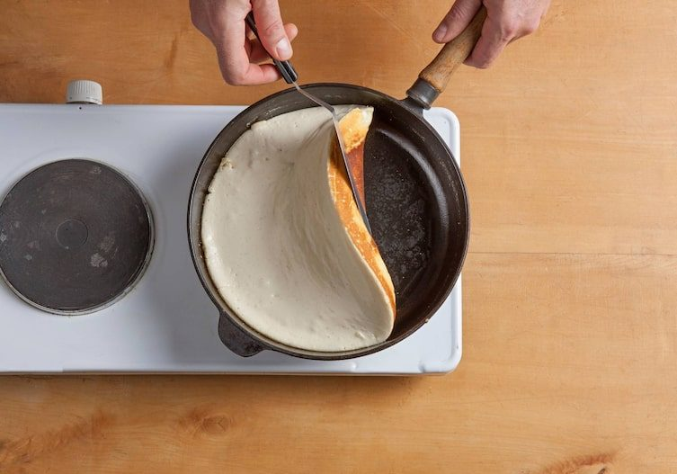
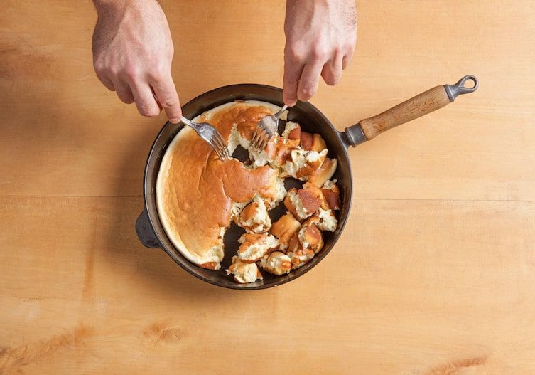
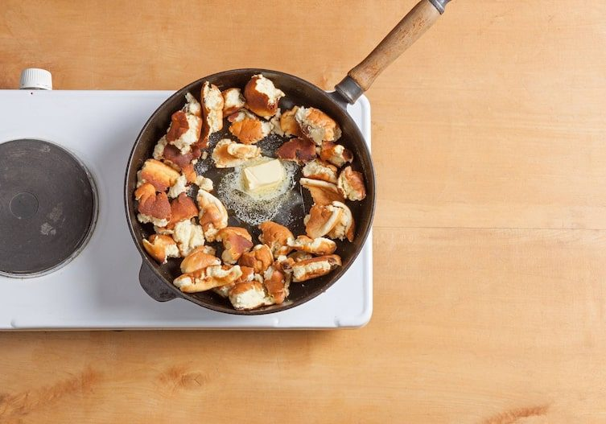
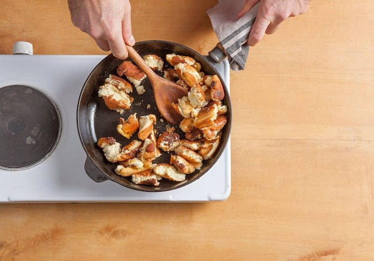
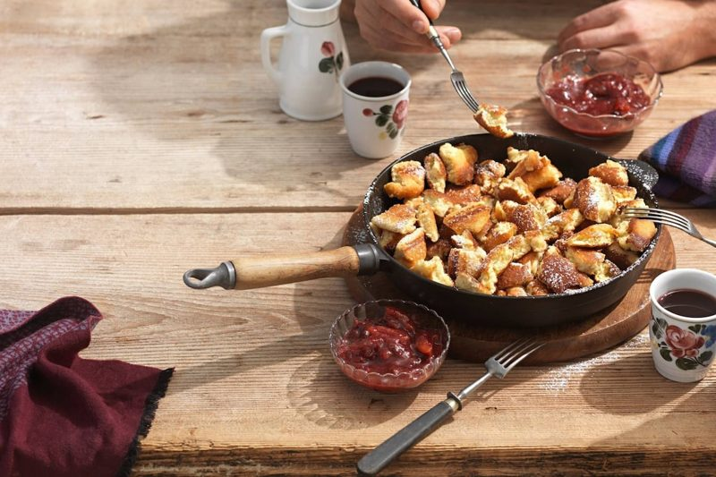

# Kaiserschmarrn 🇦🇹
*Der Kaiserschmarrn: clătită pufoasă ruptă în bucăți, cu stafide și compot de prune*

*Foto: [Gute Küche](https://www.gutekueche.at/oesterreichischer-kaiserschmarrn-rezept-4326)*

## Povestea
- **Originile:** Cuvântul *Schmarren* apare tipărit prima dată în 1563, într-o predică de nuntă a lui Johannes Mathesius („feister Schmarren"). Preparatul din aluat apare ca *Mehlschmarrn* în cărțile de bucate ale lui F. G. Zenker (1824) și Franz Zelena (1831). Cea mai veche mențiune cunoscută a **„Kaiserschmarrn"** este pe un meniu al hanului „Zum Sperl", în jurul anului 1835 ([Wien Geschichte Wiki](https://www.geschichtewiki.wien.gv.at/Schmarren)).
- **Cum a evoluat:** Povestea celebră spune că un bucătar de la curte a făcut o clătită ușoară pentru împărăteasa Elisabeta („Sisi"), dar aluatul a ieșit prea gros și s-a rupt, așa că l-a făcut bucăți și l-a caramelizat cu zahăr. Franz Joseph ar fi răspuns: *„Na, dann gebt mir halt diesen Schmarrn, den der Koch da für die Kaiserin gemacht hat."* ([Gute Küche](https://www.gutekueche.at/des-kaisers-schmarrn-artikel-4758)). Dar Wien Geschichte Wiki spune că nu rezistă unei cercetări serioase: în 1835 Franz Joseph avea cinci ani, iar Sisi nu se născuse încă. Mai probabil, „Kaiser-" înseamnă doar *calitate superioară*, ca în *Kaisersemmel*.
- **Curiozitate:** *Schmarren* vine de la *Schmer* (grăsime) și *schmieren* (a unge). În vorbirea austriacă de zi cu zi înseamnă și „prostie", așa că „So ein Schmarrn!" e un mod blând de a spune „ce prostie".

## Sfaturi de la bucătarii austrieci 👵
*N-am găsit o bunică anume pentru acest preparat, deci acestea sunt sfaturi de pe site-uri de rețete austriece și de la bucătari.*
- **Verifică spuma de albușuri (Eischnee):** un ou crud sau fiert trebuie să se scufunde pe jumătate în albușurile bătute. **Nu le bate prea mult,** altfel își pierd stabilitatea. *Confirmat* ([Servus](https://www.servus.com/a/gk/kaiserschmarrn-goldene-regeln-rezepte)).
- **Încorporează spuma doar scurt** („nur mehr wenig durchrühren"), ca să rămână aerată. *Confirmat* ([Gute Küche](https://www.gutekueche.at/oesterreichischer-kaiserschmarrn-rezept-4326)).
- **Folosește foc moderat și ai răbdare:** la foc mare proteinele din ou se închid înainte ca aburul să ridice aluatul. *Confirmat* (Servus).
- **Înmoaie stafidele în rom (sau în apă cu rom)** și pune-le în aluat la sfârșit. Un aluat gros le lasă să se scufunde încet, fără să se ardă pe fund (bucătarul Michael Vesely, Servus). *Tradiție.*
- **Aluat prea gros? Adaugă lapte. Prea subțire? Adaugă făină.** ([Gute Küche](https://www.gutekueche.at/oesterreichischer-kaiserschmarrn-rezept-4326)). *Confirmat.*
- **Fără întoarcere:** începe-l pe aragaz, apoi termină-l sub grill-ul cuptorului, pe grătarul de jos ([Servus](https://www.servus.com/r/kaiserschmarrn-mit-zwetschkenroester)), sau coace-l în cuptor la 180 °C timp de 8–10 minute ([Essen & Trinken](https://www.essen-und-trinken.de/rezepte/kaiserschmarrn-rezept-13360656.html)). *Variante.*
- **Caramelizează la sfârșit:** zahărul și untul se pun după ce rupi clătita, apoi amesteci bucățile. *Confirmat* (Servus, Gute Küche).
- **De băut:** cafea sau un Gewürztraminer Auslese cu zahăr rezidual (Servus).

**Porții** 3–4 · **Pregătire** 20 min · **Gătire** 15 min · **Ușor spre mediu**

> **Înainte să începi:** înmoaie stafidele cu cel puțin 30 de minute înainte și fă mai întâi compotul de prune (trebuie să se răcească puțin). Îți trebuie o tigaie mare antiaderentă sau din fontă (cam 28 cm) și două furculițe.

## Pregătirea ingredientelor
- [ ] Înmoaie **40 g stafide** în **3 linguri rom** (sau apă)
- [ ] Separă **4 ouă** (albușurile într-un bol foarte curat, fără grăsime)
- [ ] Cântărește **150 g făină**, **30 g zahăr** + **20 g zahăr** pentru final, **40 g unt**
- [ ] Taie în două și scoate sâmburii la **500 g prune** pentru compot
- [ ] Două furculițe și o spatulă

## Ingrediente
**Kaiserschmarrn**
- [ ] 4 ouă (mărimea M)
- [ ] 150 g făină albă (austriacă *glatt*, tip W480)
- [ ] 250 ml lapte
- [ ] 30 g zahăr pentru aluat + cam 20 g (2 linguri) pentru caramelizare
- [ ] 1 plic zahăr vanilat (cam 8 g)
- [ ] 1 vârf de sare
- [ ] 40 g stafide, înmuiate în 3 linguri rom sau apă
- [ ] 40 g unt (20 g pentru tigaie, 20 g la final)
- [ ] Zahăr pudră pentru pudrat

**Compot de prune (*Zwetschkenröster*)**
- [ ] 500 g prune (*Zwetschken*)
- [ ] 100 g zahăr
- [ ] 2 linguri apă
- [ ] 1 felie de lămâie
- [ ] 1 baton de scorțișoară
- [ ] 3 cuișoare

## Pași
1. [ ] **Stafidele:** pune **40 g stafide** cu **3 linguri rom** (sau apă) într-un bol mic.
   ⏱ **30 min** — *cel puțin; 1–2 ore e mai bine.*
2. [ ] **Compotul de prune:** taie în două și scoate sâmburii la **500 g prune**. Fierbe **100 g zahăr**, **2 linguri apă**, **1 felie de lămâie**, **1 baton de scorțișoară** și **3 cuișoare**, adaugă prunele și fierbe la foc mic. Lasă să se răcească puțin, apoi scoate lămâia și mirodeniile.
   ⏱ **10 min** — *prunele moi, dar întregi.*
3. [ ] **Spuma de albușuri:** bate **cele 4 albușuri** cu **1 vârf de sare** într-un bol curat până se întăresc. *Oprește-te când sunt ferme; nu le bate prea mult.*
4. [ ] **Aluatul:** freacă **cele 4 gălbenușuri** cu **30 g zahăr** și **1 plic zahăr vanilat** până devin spumoase, apoi amestecă cu **250 ml lapte** și **150 g făină** până obții un aluat neted, lichid.

   
   *Amestecă până obții un aluat neted, lichid · Foto: [Servus](https://www.servus.com/r/altwiener-kaiserschmarrn)*

5. [ ] **Încorporarea:** încorporează ușor spuma de albușuri în aluat, doar scurt, apoi adaugă **stafidele scurse**.

   
   *Încorporează spuma, păstreaz-o aerată · Foto: [Servus](https://www.servus.com/r/altwiener-kaiserschmarrn)*

6. [ ] **Coacerea:** topește **20 g unt** într-o tigaie mare la foc mediu, toarnă aluatul (gros de **cam 2 cm**) și gătește. *Ridică marginea cu o spatulă ca să vezi dacă fundul e rumenit.*
   ⏱ **5 min** — *fundul auriu-brun, deasupra încă moale.*

   
   *Verifică fundul · Foto: [Servus](https://www.servus.com/r/altwiener-kaiserschmarrn)*

7. [ ] **Întoarcerea:** taie clătita în patru cu spatula, întoarce bucățile și coace până se rumenesc și pe cealaltă parte.
   ⏱ **4 min** — *auriu-brun peste tot.*
8. [ ] **Ruperea:** rupe clătita în bucăți cu **două furculițe**.

   
   *Rupe-o cu două furculițe · Foto: [Servus](https://www.servus.com/r/altwiener-kaiserschmarrn)*

9. [ ] **Caramelizarea:** presară **cam 20 g zahăr** peste bucăți, adaugă restul de **20 g unt** și amestecă bucățile de câteva ori până când zahărul se caramelizează ușor.

   
   *Zahărul și untul intră la sfârșit · Foto: [Servus](https://www.servus.com/r/altwiener-kaiserschmarrn)*

   
   *Amestecă până se caramelizează ușor · Foto: [Servus](https://www.servus.com/r/altwiener-kaiserschmarrn)*

10. [ ] Pudrează cu **zahăr pudră** și servește imediat cu **compotul de prune cald**.

    
    *Servit cu compot de prune · Foto: [Servus](https://www.servus.com/r/kaiserschmarrn-mit-zwetschkenroester)*

## Cronometre – pe scurt
| Pas | Timp | Ce urmărești |
|---|---|---|
| Stafide | 30 min+ | Umflate |
| Compot de prune | 10 min | Prune moi, nu terci |
| Prima parte | 5 min | Fund auriu |
| A doua parte | 4 min | Auriu-brun |

## Dacă ceva nu merge
- **Plat și dens:** spuma de albușuri a fost bătută prea mult sau amestecată prea tare. Încorporeaz-o blând și scurt.
- **Uscat:** aluatul era prea gros (adaugă lapte) sau a stat prea mult la foc.
- **Ars pe dinafară, crud înăuntru:** foc prea mare. Folosește foc moderat sau termină-l în cuptor.
- **Cauciucat:** ai amestecat prea mult după ce a intrat făina.
- **Stafide arse:** pune-le în aluat la sfârșit, ca mai sus.

## Servire, păstrare, reîncălzire
Se servește direct din tigaie, pudrat cu zahăr, cu compot de prune cald (sau cu piure de mere). Kaiserschmarrn e cel mai bun proaspăt; ce rămâne se poate încălzi scurt într-o tigaie cu puțin unt. Compotul se ține câteva zile la frigider.

---

## Listă de cumpărături
- [ ] **Lactate și ouă:** 4 ouă, lapte (250 ml), unt (40 g)
- [ ] **Legume și fructe:** prune (500 g), 1 lămâie
- [ ] **Cămară:** făină (150 g), zahăr (150 g), zahăr vanilat, sare, stafide (40 g), rom (3 linguri, opțional), zahăr pudră, 1 baton de scorțișoară, 3 cuișoare

## Echipament
Tigaie mare antiaderentă sau din fontă (cam 28 cm), două boluri, tel și mixer de mână, spatulă, două furculițe, o oală mică pentru compot.

## Surse comparate
Baza: [Gute Küche](https://www.gutekueche.at/oesterreichischer-kaiserschmarrn-rezept-4326) (4 ouă, 150 g făină, 250 ml lapte; 3.199 de evaluări, 4,5). Verificări: [Servus, Altwiener](https://www.servus.com/r/altwiener-kaiserschmarrn) (5 ouă, 220 g făină, 400 ml lapte; poze pas cu pas), [Servus cu Zwetschkenröster](https://www.servus.com/r/kaiserschmarrn-mit-zwetschkenroester) (4 ouă, 100 g făină, 250 ml lapte; cantitățile pentru compot), [Servus, regulile de aur](https://www.servus.com/a/gk/kaiserschmarrn-goldene-regeln-rezepte), [kochrezepte.at](https://www.kochrezepte.at/kaiserschmarren-mit-zwetschkenroester-rezept-1498) (6 ouă, 200 g făină, 250 ml lapte), [Essen & Trinken](https://www.essen-und-trinken.de/rezepte/kaiserschmarrn-rezept-13360656.html) (site german: 2 ouă, 80 g făină, metoda la cuptor) și [Wien Geschichte Wiki](https://www.geschichtewiki.wien.gv.at/Schmarren) (istorie). Făina variază între 25 și 44 g la ou; mediana e cam 37 g, deci 150 g la 4 ouă. Laptele e cam 62 ml la ou în majoritatea rețetelor, deci 250 ml. Grăsimea și zahărul variază mult, așa că am luat 40 g unt și cam 50 g zahăr în total, plus compotul.

## Variante
- **Terminat în cuptor (fără întoarcere):** după cam 5 minute pe aragaz, termină sub grill-ul cuptorului, pe grătarul de jos (Servus).
- **Cu rom flambat:** aprinde scurt romul într-o polonică și toarnă-l peste bucăți (Servus).
- **Cu piure de mere** în loc de compot de prune.
