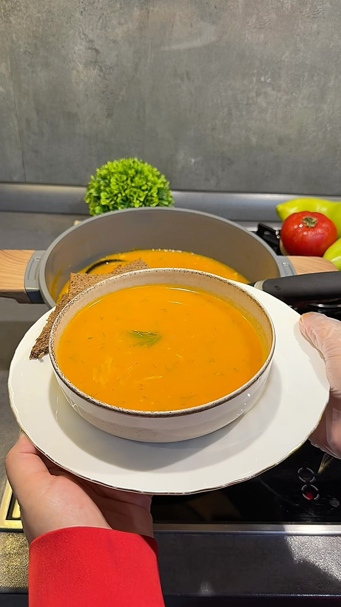

# Supă rapidă de pui cu legume 🍲
*Быстрый куриный супчик с овощами*

*Foto: coperta [reelului lui Shabnami Rustam](https://www.facebook.com/share/r/18Y59L8VxM/)*

> **Sursa:** rețeta vine din reelul de mai sus (2,4 mil. vizualizări). Reelul dă ingredientele și metoda, dar **nu și cantitățile de apă, paste sau sare**; le-am completat de pe site-uri rusești de gătit și le-am marcat *(obișnuit)*.

## Povestea
- **Originile:** Supa de pui e veche ca leac: se spune că Hipocrate și Avicenna o recomandau bolnavilor slăbiți, iar medicul Maimonide prescria supă de pui în Evul Mediu ([Zakon.kz](https://www.zakon.kz/stati/6510903-den-kurinogo-supalapshi-pravda-li-chto-on-lechit-i-kak-sdelat-blyudo-poleznym.html), rezumat din căutare). În țările slave a devenit un preparat de zi cu zi, adesea cu tăiței de casă din ou.
- **Cum a evoluat:** Versiunea clasică fierbe o găină 1,5 ore și călește mai întâi ceapa și morcovul. Versiunea din reel sare peste amândouă: totul fierbe împreună, apoi **legumele se mixează** în supă pentru consistență, iar supa e gata în mai puțin de o oră. Nu am găsit nimic precis despre istoria preparatului în Rusia.
- **Curiozitate:** Supa de pui e faimoasă ca remediu pentru răceală, datorită aminoacidului cisteină ([Zakon.kz](https://www.zakon.kz/stati/6510903-den-kurinogo-supalapshi-pravda-li-chto-on-lechit-i-kak-sdelat-blyudo-poleznym.html)). Supa fierbinte ajută cu căldură și lichide; „vindecă răceala" e afirmația populară, nu una dovedită.

## Sfaturile bunicii 👵
*De pe site-uri rusești care descriu metoda de modă veche (a bunicii):*
- **Începe cu apă rece, adu încet la fiert, apoi ia spuma complet.** Asta e cheia unei supe limpezi. *Confirmat de mai multe surse* ([UNIAN](https://www.unian.net/lite/advice/kak-cdelat-kurinyy-bulon-vkusnee-dostatochno-ispolzovat-eti-3-ingredienta-12750144.html), [E1](https://www.e1.ru/text/food/2026/03/29/76333550/)).
- **Lasă ceapa în coajă** (curăță doar stratul de sus): coaja dă culoare aurie, iar ceapa întărește gustul de pui. *Tradiție* (UNIAN). În rețeta asta ceapa se mixează, deci culoarea vine de la morcovi și roșie.
- **Pune mărarul chiar la sfârșit, cu măsură.** *Tradiție* (UNIAN).
- **Lasă supa să se odihnească acoperită, de pe foc.** E1 spune 10–15 minute, Lady.mail.ru spune 20–30. *Confirmat* ([E1](https://www.e1.ru/text/food/2026/03/29/76333550/), [Lady.mail.ru](https://lady.mail.ru/recipe/24757-sup-na-kurinom-bulone-s-vermishelju/)).
- **Fierbe pastele separat dacă păstrezi resturi,** ca să nu se umfle a doua zi. *Sfatul bunicii* (E1).
- **Pentru o supă mai bogată folosește o găină de supă și fierbe cel puțin 1,5 ore.** *Tradiție,* pentru varianta lentă (UNIAN).

**Porții** 5–6 · **Pregătire** 15 min · **Gătire** 35 min · **Total** aproximativ 55 min · **Ușor**

> **Înainte să începi:** scoate o oală de 3 L și blenderul vertical și spală mărarul sau pătrunjelul.

## Pregătirea ingredientelor
- [ ] Curăță 2 cartofi, 2 morcovi, 1 ceapă și 1 cățel de usturoi
- [ ] Taie cartofii și morcovii bucăți, ceapa în patru, iar ardeiul și roșia curățate de semințe, în patru
- [ ] Măsoară 2,5 L apă rece
- [ ] Toacă mărarul sau pătrunjelul și stoarce jumătate de lămâie
- [ ] Pregătește blenderul vertical și o farfurie pentru pui

## Ingrediente
- [ ] 2 piepți de pui
- [ ] 2 cartofi
- [ ] 2 morcovi
- [ ] 1 ceapă
- [ ] 1 ardei gras
- [ ] 1 roșie
- [ ] 1 cățel de usturoi
- [ ] 2,5 L apă rece *(obișnuit, pentru o oală de 3 L)*
- [ ] 1 linguriță sare la început, mai mult după gust *(obișnuit)*
- [ ] 80 g paste fine sau fidea, cam 2 pumni mici *(obișnuit; „puține" în reel)*
- [ ] Un pumn de mărar sau pătrunjel proaspăt
- [ ] Zeama de la ½ lămâie

## Pași
1. [ ] Pune în oală **2 piepți de pui**, **2 cartofi**, **2 morcovi**, **1 ceapă**, **1 ardei gras**, **1 roșie** și **1 cățel de usturoi**. Toarnă **2,5 L apă rece** și adaugă **1 linguriță sare**.
2. [ ] Adu la fiert la foc mediu-mare, **ia toată spuma**, apoi coboară la un fiert domol.
   ⏱ **25 min** — *puiul alb în mijloc, cartofii și morcovii moi.* *(obișnuit; reelul spune doar „până e gata")*
3. [ ] Scoate puiul pe o farfurie, lasă-l să se răcească puțin, apoi desfă-l fire.
4. [ ] Dă oala de pe foc și mixează **legumele** cu blenderul vertical până se omogenizează. *Ține puiul afară, ca să nu se prindă în blender.*
5. [ ] Pune puiul desfăcut înapoi în supă. Adu la fiert domol și adaugă **80 g paste**. Fierbe-le **cu 1–2 minute mai puțin decât scrie pe pachet**.
   ⏱ **5 min** — *pastele abia moi.*
6. [ ] Stinge focul. Amestecă **un pumn de mărar sau pătrunjel tocat** și **zeama de la ½ lămâie**. Gustă și mai adaugă sare dacă trebuie. Acoperă și lasă la odihnă.
   ⏱ **10 min** — *aromele se așază; pastele se înmoaie complet.*

## Cronometre – pe scurt
| Pas | Timp | Ce urmărești |
|---|---|---|
| Fierbere | 25 min | Pui alb în mijloc, legume moi |
| Paste | 5 min | Abia moi |
| Odihnă | 10 min | Acoperită, de pe foc |

## Dacă ceva nu merge
- **Supă tulbure:** a fiert prea tare sau nu s-a luat spuma. Fierbe domol și degresează.
- **Fadă:** adaugă sare câte un praf și puțină lămâie în plus.
- **Prea groasă:** adaugă apă fierbinte câte puțin.
- **Pui uscat:** nu fierbe pieptul mult peste 25 de minute; desfă-l imediat.
- **Paste moi a doua zi:** fierbe pastele separat pentru resturi.

## Servire, păstrare, reîncălzire
Se servește fierbinte cu pâine neagră, mărar în plus și o felie de lămâie. Se ține 2–3 zile la frigider; reîncălzește blând și adaugă apă dacă s-a îngroșat. Supa fără paste se poate congela.

---

## Listă de cumpărături
- [ ] **Carne:** 2 piepți de pui
- [ ] **Legume:** 2 cartofi, 2 morcovi, 1 ceapă, 1 ardei gras, 1 roșie, 1 usturoi, mărar sau pătrunjel, 1 lămâie
- [ ] **Cămară:** paste fine sau fidea (80 g), sare

## Surse comparate
Rețeta este [reelul lui Shabnami Rustam](https://www.facebook.com/share/r/18Y59L8VxM/). Cantitățile și sfaturile sunt verificate pe patru site-uri rusești: [E1](https://www.e1.ru/text/food/2026/03/29/76333550/) (oală de 3 L, 2,5 L apă, 80–100 g fidea), [Mentoday](https://www.mentoday.ru/recipes/recept-sytnogo-kurinogo-supa-s-vermishelyu/) (500 g pui, 2 L apă), [Lady.mail.ru](https://lady.mail.ru/recipe/24757-sup-na-kurinom-bulone-s-vermishelju/) (odihnă 20–30 min) și [UNIAN](https://www.unian.net/lite/advice/kak-cdelat-kurinyy-bulon-vkusnee-dostatochno-ispolzovat-eti-3-ingredienta-12750144.html) (metoda bunicii). Niciunul nu mixează legumele; e trucul reelului. Am citit reelul din descrierea publică, nu am vizionat videoclipul.

## Variante
- **Varianta cu supă limpede:** lasă ceapa în coajă, călește scurt morcovul ras în ulei și nu mixa.
- **Fără lămâie:** lămâia e finalul din reel; las-o deoparte dacă preferi o supă simplă.
