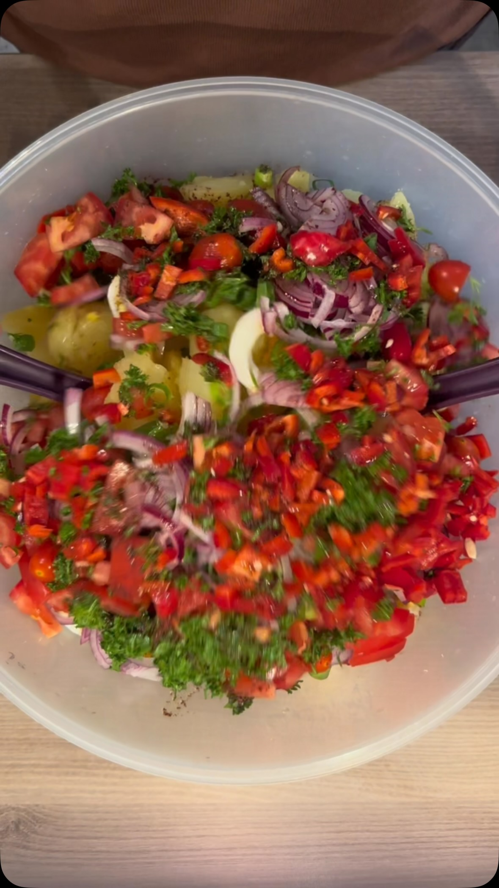

# Turkish-Style Potato Salad 🇹🇷
*Türkische Art Kartoffelsalat · Patates salatası*

*Photo: cover of the [reel by Neris Kitchen](https://www.facebook.com/share/r/1GKsyh4AtA/)*

> **Source:** the recipe is the full caption of the reel above (264 K views), written in German with all amounts. I added only what it leaves out and marked it *(typical)*, and cross-checked the dish against Turkish recipe sites.

## The story
- **Origins:** Potatoes reached the Ottoman kitchen late. They were imported from Europe and sold in Istanbul's markets in the 1850s, and were first grown on the Sakarya plain in 1876, when the governor Ahmet Vefik Pasha pushed farmers to try them. The first Ottoman text to name them is his 1876 dictionary *Lugat-ı Osmani*, as "patata" (Turkish history sites, search summary; I did not open the pages).
- **How it evolved:** The classic *patates salatası* is simple: boiled potatoes with parsley and spring onion, olive oil, lemon and sumac ([Yemek.com](https://yemek.com/tarif/patates-salatasi)). No mayonnaise. This reel's version is richer: eggs, red peppers, tomatoes and **pomegranate molasses**, closer to a full salad-table dish.
- **Fun fact:** Farmers first refused potatoes because of their earthy smell, so the governor won them a 15-year tax exemption for growing them (Turkish history sites, search summary).

## Grandma's tips 👵
*From Turkish recipe sites. I could not find a named grandmother, so these are home-cook tips.*
- **Let the potatoes cool to room temperature before adding the greens and vegetables.** *Confirmed* ([Yemek.com](https://yemek.com/tarif/patates-salatasi)).
- **Dress them while still lukewarm so they soak up the sauce.** *Tradition* (Turkish recipe sites, search summary). Together with the tip above: add the dressing while the potatoes are just warm, the fresh vegetables once they have cooled.
- **Make it ahead.** The night before, or several hours before, lets the flavours blend. *Confirmed* ([Milliyet](https://www.milliyet.com.tr/pembenar/galeri/kivaminda-patates-salatasinin-sirriymis-yarim-su-bardagi-ekleyen-yedikce-yiyor-7311374/5)).
- **Scrub the skins well before boiling, and take the potatoes off the heat as soon as a fork slides in** so they don't turn mushy. *Tradition* (Arçelik blog, via search summary; the page was blocked).
- **Waxy potatoes** (small, smooth-skinned) hold their shape better. *Tradition* (search summary).
- **Some cooks add half a cup of vinegar** for a sharper taste ([Milliyet](https://www.milliyet.com.tr/pembenar/galeri/kivaminda-patates-salatasinin-sirriymis-yarim-su-bardagi-ekleyen-yedikce-yiyor-7311374/5)). *Tradition,* not in this recipe, which gets its sourness from lemon and pomegranate molasses.
- **If the salad turns dry, stir in a little warm water.** *The reel's own tip.*

**Serves** 6–8 · **Prep** 25 min · **Cook** 25 min · **Rest** 30 min+ · **Easy**

> **Before you start:** take out a big pot for the potatoes, a small pot for the eggs, and your largest mixing bowl.

## Mise en place
- [ ] Scrub 1.5 kg potatoes
- [ ] Wash the parsley, peppers and tomatoes
- [ ] Measure the dressing: 7 tbsp olive oil, 2 tsp salt, 2 tsp sumac, 1 tsp pepper, 1.5 tbsp pomegranate molasses, 100 ml warm water
- [ ] Squeeze the juice of 2 lemons

## Ingredients
**Salad**
- [ ] 1.5 kg potatoes (boiled in their skins)
- [ ] 6 eggs (boiled 10 minutes)
- [ ] 2 onions (red, as in the cover photo)
- [ ] 4 spring onions, in rings
- [ ] 2 red bell peppers
- [ ] 1 large tomato + a handful of cherry tomatoes, diced
- [ ] 1 big handful of parsley, chopped
- [ ] Juice of 2 lemons

**Dressing**
- [ ] 7 tbsp olive oil
- [ ] 2 tsp salt
- [ ] 2 tsp sumac
- [ ] 1 tsp pepper
- [ ] 1.5 tbsp pomegranate molasses
- [ ] 100 ml warm water

## Steps
1. [ ] Put **1.5 kg potatoes** in a big pot, cover with cold water and bring to the boil. Cook them in their skins until a fork slides in easily. *Don't let them go mushy.*
   ⏱ **25 min** — *fork slides in easily.* *(typical; the reel gives no time)*
2. [ ] Meanwhile boil **6 eggs** in a separate pot.
   ⏱ **10 min** — *hard-boiled.* Cool them in cold water.
3. [ ] Drain the potatoes. While still warm, peel them and cut into slices or cubes. Peel the **6 eggs** and chop or slice them.
4. [ ] Chop **2 onions**, slice **4 spring onions** into rings, dice **2 red peppers**, **1 large tomato** and **a handful of cherry tomatoes**, and chop **a big handful of parsley**. *(dicing the onions and peppers is typical; the reel only says to dice the tomatoes)*
5. [ ] Whisk the dressing: **7 tbsp olive oil**, **2 tsp salt**, **2 tsp sumac**, **1 tsp pepper**, **1.5 tbsp pomegranate molasses**, the **juice of 2 lemons** and **100 ml warm water**.
6. [ ] Put the potatoes in your largest bowl. Add the prepared vegetables and parsley, pour over the dressing and **fold in the eggs** gently. *The tips above: add the dressing while the potatoes are just warm.*
7. [ ] Let it rest, covered, so the flavours blend. If it looks dry, stir in a little warm water.
   ⏱ **30 min** — *at least; 2–3 hours in the fridge is better.* *(typical)*

## Timer cheat-sheet
| Step | Time | Look for |
|---|---|---|
| Potatoes | 25 min | Fork slides in easily |
| Eggs | 10 min | Hard-boiled |
| Rest | 30 min+ | Dry? add warm water |

## If it goes wrong
- **Mushy potatoes:** next time pull them as soon as a fork slides in; use waxy potatoes.
- **Dry salad:** stir in a little warm water.
- **Watery salad:** drain the diced tomatoes briefly and don't add the dressing to hot potatoes.
- **Flat taste:** more salt, lemon juice or sumac, a little at a time.
- **Too sharp:** add a spoon of olive oil.

## Serve, store, reheat
Serve at room temperature or chilled, with bread, grilled meat or as part of a mezze table. Keeps up to 3 days in the fridge ([Yemek.com](https://yemek.com/tarif/patates-salatasi), because of the fresh onions).

---

## Grocery list
- [ ] **Produce:** potatoes 1.5 kg, onions 2, spring onions 4, red bell peppers 2, tomato 1 large + cherry tomatoes, parsley, lemons 2
- [ ] **Eggs:** 6
- [ ] **Pantry:** olive oil, salt, black pepper
- [ ] **Specialty (Turkish or Middle Eastern shop):** sumac, pomegranate molasses

## Sources compared
The recipe is the [reel by Neris Kitchen](https://www.facebook.com/share/r/1GKsyh4AtA/), read from its public caption (I could not watch the video). Turkish cross-checks: [Yemek.com](https://yemek.com/tarif/patates-salatasi) (olive oil, lemon, sumac, parsley, 3-day storage), [Yemek.com, onion version](https://yemek.com/tarif/soganli-patates-salatasi/) (sumac and pomegranate molasses together), [Milliyet](https://www.milliyet.com.tr/pembenar/galeri/kivaminda-patates-salatasinin-sirriymis-yarim-su-bardagi-ekleyen-yedikce-yiyor-7311374/5) (resting, vinegar). The history and some tips are from search summaries; Arçelik blocked fetching. None of the Turkish pages use eggs or peppers; those are the reel's own.

## Variants
- **Classic Turkish version:** only potatoes, spring onion, parsley, olive oil, lemon and sumac.
- **Sharper:** add a splash of vinegar (a Milliyet tip).
