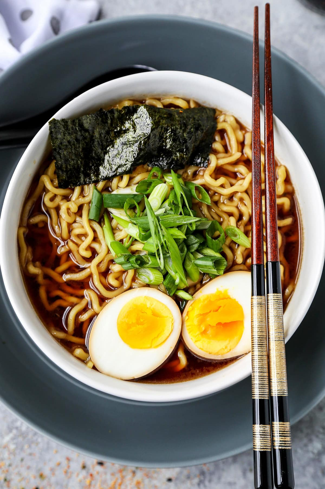
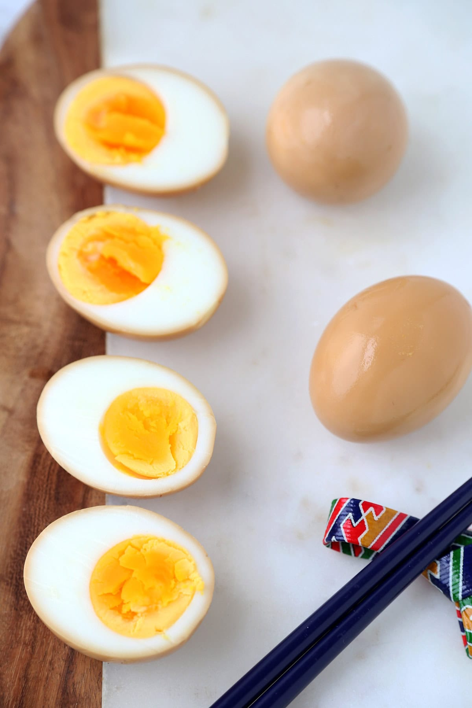
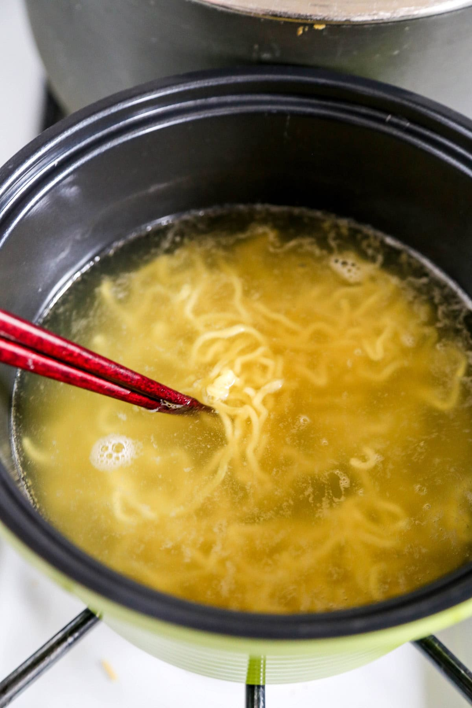

# Shoyu Ramen 醤油ラーメン 🇯🇵

*Photo: [Pickled Plum](https://pickledplum.com/shoyu-ramen/)*

## The story
- **Origins:** Ramen began as Chinese wheat noodles in soup, brought to Japan by Chinese immigrants after Yokohama became an international port in 1859 ([Tokyo Weekender](https://www.tokyoweekender.com/?p=295578), search summary). It was first called *Nankin soba*, and Japanese diners found it too heavy and greasy ([Yokohama City](https://www.welcome.city.yokohama.jp/blog/detail.php?blog_id=79)).
- **How it evolved:** In 1910 *Rairaiken* in Asakusa, Tokyo, tuned the dish to Japanese taste with less pork and less grease, and sold *shina soba*, wonton and shumai cheaply. It is credited with starting Japan's ramen boom, though the "true first ramen" is unclear. The name went *Nankin soba* → *shina soba* → *chūka soba* → "ramen", which became the everyday word after instant Chicken Ramen arrived in 1958. The clear soy-and-chicken bowl below is the Tokyo classic.
- **Fun fact:** Rairaiken closed in 1976 and was brought back in 2020 at the Shin-Yokohama Ramen Museum, using period recipes and ingredients.

## Local home-cook tips 🍜
*I searched for grandmother sources (おばあちゃん, 昔ながらの中華そば) but only found restaurant listings. These are tips from Japanese recipe authors instead.*
- **Cook the noodles a little firm.** They keep softening in the hot soup. *Confirmed* (Japanese recipe sites, search summary).
- **Put the tare in the bowl first, then pour in the hot broth.** *Confirmed* ([Wikibooks JP](https://ja.wikibooks.org/wiki/%E6%96%99%E7%90%86%E6%9C%AC/%E9%86%A4%E6%B2%B9%E3%83%A9%E3%83%BC%E3%83%A1%E3%83%B3)).
- **Use dashi (bonito or niboshi stock) instead of plain water** for the quick version to get more depth ([Macaroni](https://macaro-ni.jp/50277)). *Author tip.*
- **Niboshi (dried sardine) broth must never boil.** Hold it at 80–85 °C or it turns bitter ([Kazamidori Shin on Cookpad](https://cookpad.com/recipe/4776068)). *Author tip, for the niboshi variant.*
- **Make it ahead.** A broth keeps up to 5 days in the fridge ([Pickled Plum](https://pickledplum.com/shoyu-ramen/)). Chashu and eggs are made the day before.

**Serves** 2 · **Prep** 30 min · **Stock** 3 h · **Total** ~4 h (+ overnight eggs) · **Medium**

> **Before you start:** make the eggs (step 1) and the chashu (step 2) the day before. On the day, start the stock about 4 hours before eating.

## Mise en place
- [ ] Rinse 250 g chicken bones and 150 g pork bones under cold water
- [ ] Peel and halve the onion, smash the garlic, slice the ginger
- [ ] Measure the tare ingredients into a small pot
- [ ] Slice the scallions, cut the nori, open the menma
- [ ] Put 2 bowls where you can warm them

## Ingredients (2 bowls)
**Stock** (makes about 700 ml; scaled from the Wikibooks 5-bowl recipe)
- [ ] 250 g chicken carcass or wings
- [ ] 150 g pork bones
- [ ] ½ onion
- [ ] 1 clove garlic
- [ ] 1 thumb of ginger
- [ ] ½ leek (green part)
- [ ] ½ tsp salt
- [ ] 1 L water

**Shoyu tare** (about 80 ml)
- [ ] 40 ml soy sauce
- [ ] 12 ml mirin
- [ ] ½ tbsp sugar
- [ ] 20 ml sake

**Per bowl**
- [ ] 2 portions fresh Chinese (ramen) noodles, about 120 g each
- [ ] 4 slices chashu (see step 2) or bought
- [ ] 2 soy-marinated eggs (*ajitama*, step 1)
- [ ] Menma (seasoned bamboo shoots), as you like
- [ ] 1–2 stalks spinach
- [ ] 1 scallion, sliced
- [ ] 1–2 sheets nori

**Eggs and chashu** *(typical home method, not from the compared sources)*
- [ ] 2 eggs; marinade of 50 ml soy, 50 ml mirin, 50 ml water
- [ ] 300 g pork shoulder or belly; 150 ml soy, 100 ml sake, 100 ml mirin, 2 tbsp sugar, 300 ml water

## Steps
**The day before**
1. [ ] **Eggs:** lower 2 eggs into boiling water, cook, then chill in ice water and peel. Marinate in the soy-mirin-water mix overnight in the fridge.
   ⏱ **7 min** — *whites set, yolk jammy.* *(typical timing, not from the sources)*

   
   *Marinated eggs: soy-brown outside, jammy yolk · Photo: [Pickled Plum](https://pickledplum.com/shoyu-ramen/)*

2. [ ] **Chashu:** roll and tie the pork, simmer gently in the soy-sake-mirin-sugar-water mix, turning once. Cool in the liquid, then chill. *(typical method, not from the sources; you can buy chashu instead)*
   ⏱ **1 h 30 min** — *a skewer slides in easily.*

**On the day**
3. [ ] **Stock:** put the bones, onion, garlic, ginger, leek, salt and cold water in a pot. Bring to the boil, skim the grey foam, then drop to a **gentle simmer** and skim now and then. *A cloudy stock means it boiled too hard.* Strain.
   ⏱ **3 h** — *broth golden and clear, tastes of chicken.*
4. [ ] **Tare:** put the soy, mirin, sugar and sake in a small pot, bring to a simmer **once**, then take off the heat.
5. [ ] **Toppings:** blanch the spinach briefly and cut it into 3 cm pieces. Slice the chashu, halve the eggs, slice the scallions. Warm the bowls.
6. [ ] **Noodles:** boil in plenty of water. Cook them a little **firm**, since they soften in the soup.
   ⏱ **2–3 min** — *firm to the bite.*

   
   *Noodles in the pot, lifted with chopsticks · Photo: [Pickled Plum](https://pickledplum.com/shoyu-ramen/)*

7. [ ] **Assemble:** put 30–40 ml tare in each warm bowl, add about 350 ml **very hot** broth and stir. Drain the noodles well and add them, then arrange the chashu, egg, spinach, menma, scallion and nori. Eat right away.

## Timer cheat-sheet
| Step | Time | Look for |
|---|---|---|
| Eggs | 7 min | Jammy yolk |
| Chashu | 1 h 30 | Skewer slides in |
| Stock | 3 h | Clear, golden |
| Noodles | 2–3 min | Firm to the bite |

## If it goes wrong
- **Cloudy broth:** it boiled too hard. Keep it at a gentle simmer and skim.
- **Too salty:** add hot water or unsalted broth.
- **Bland:** add tare 1 tsp at a time.
- **Soggy noodles:** pull them earlier and drain well.
- **Cold bowl:** warm the bowls first.

## Serve, store, reheat
Eat immediately. Keep stock up to 5 days in the fridge, and chashu and eggs for a few days. Never store noodles in the soup.

---

## Grocery list
- [ ] **Meat:** chicken carcass or wings 250 g, pork bones 150 g, pork shoulder or belly 300 g (or ready-made chashu)
- [ ] **Produce:** onion, garlic, ginger, leek, spinach, scallions
- [ ] **Eggs:** 4 (2 for the soy eggs, 2 spare)
- [ ] **Pantry:** soy sauce (Japanese), mirin, sake, sugar, salt
- [ ] **Specialty (Asian store):** fresh ramen noodles, menma, nori

## Sources compared
[Wikibooks JP](https://ja.wikibooks.org/wiki/%E6%96%99%E7%90%86%E6%9C%AC/%E9%86%A4%E6%B2%B9%E3%83%A9%E3%83%BC%E3%83%A1%E3%83%B3) (3-hour stock, tare ratios), [Macaroni](https://macaro-ni.jp/50277) (10-minute version), [Pickled Plum](https://pickledplum.com/shoyu-ramen/) (quick broth, photos), [Kazamidori Shin, Cookpad](https://cookpad.com/recipe/4776068) (niboshi, no-boil rule), [Yokohama City](https://www.welcome.city.yokohama.jp/blog/detail.php?blog_id=79) (history). Delish Kitchen was only an index page. The sources do not give egg or chashu methods, so those are typical home methods.

## Variants
- **10-minute version** (Macaroni): 800 cc water, 2 tbsp soy, 1 tbsp chicken bouillon powder, 1 tsp oyster sauce, a little garlic, salt and pepper.
- **Niboshi ramen:** cold-soak niboshi and kombu overnight, then heat to 80–85 °C and never boil.
