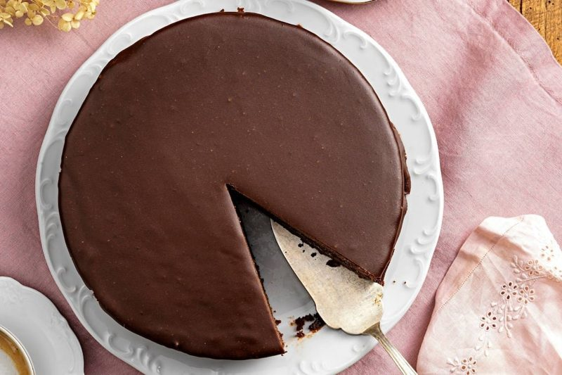
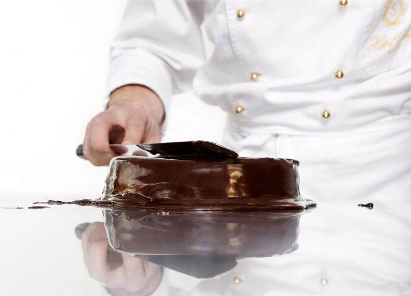
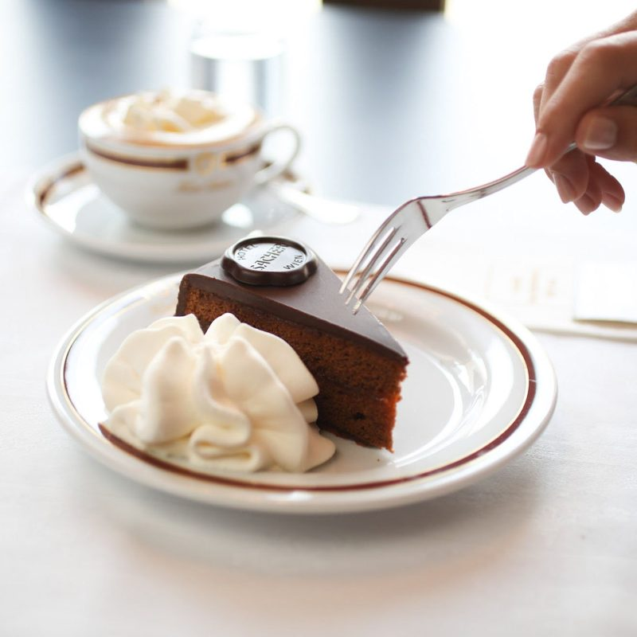

# Sachertorte 🇦🇹
*Die Sachertorte: tortul vienez de ciocolată cu gem de caise, în stilul Hotel Sacher*

*Foto: [Servus](https://www.servus.com/r/sachertorte) (Ingo Eisenhut)*

> **Sursa:** aceasta este **rețeta de casă pe care o publică chiar Hotel Sacher** ([pagina în germană](https://www.sacher.com/de/original-sacher-torte/rezept/), aceeași cu [pagina în engleză](https://www.sacher.com/en/original-sacher-torte/recipe/) pe care mi-ai trimis-o). Hotelul spune că este *„doar o aproximare a rețetei originale, care desigur trebuie să rămână un secret bine păstrat."* Am folosit pagina în germană ca bază și am verificat-o cu rețete austriece.

## Povestea
- **Originile:** Hotelul o povestește așa: în 1832, prințul Metternich aștepta oaspeți și a cerut un desert special. Bucătarul era bolnav, așa că a intervenit ucenicul de 16 ani **Franz Sacher**, iar Metternich l-a avertizat pe drumul spre bucătărie: *„Dass er mir aber keine Schand' macht, heut' Abend!"* Tortul a ajuns apoi pe masa curții imperiale ([Hotel Sacher](https://www.sacher.com/de/original-sacher-torte/rezept/)). Wien Geschichte Wiki e mai prudent: spune că dovezile indică mai degrabă **anii 1840, în Ungaria**, citând un articol din 1906 din *Neues Wiener Tagblatt*, și notează că glazura cere o tehnologie de rafinare a ciocolatei care exista abia de la mijlocul secolului al XIX-lea ([Wien Geschichte Wiki](https://www.geschichtewiki.wien.gv.at/Sachertorte)).
- **Cum a evoluat:** După ce Hotel Sacher a ajuns în dificultate și a fost vândut în 1934, Eduard Sacher (fiul lui Franz) a vândut rețeta cofetăriei **Demel**. A urmat o lungă dispută pentru numele „Original Sachertorte", încheiată în afara instanței în **1963**. De atunci hotelul poate numi tortul său „Original Sachertorte", iar Demel vinde „Demel's Sachertorte". Diferența: tortul hotelului are gem de caise **și la mijloc, și sub glazură** și un sigiliu **rotund**; cel de la Demel avea inițial gem doar sub glazură și un sigiliu **triunghiular** (Wien Geschichte Wiki; Demel a adăugat și stratul de la mijloc din 2020, după un rezumat de căutare pe care nu l-am deschis).
- **Curiozitate:** Hotelul face cam **360.000** de Sachertorte pe an, pentru livrare în toată lumea (Wien Geschichte Wiki), și spune că geniul tortului e simplitatea lui: unt, zahăr, ouă, ciocolată, făină, vanilie și gem de caise, „mai aproape de Bauhaus decât de Baroc".

## Sfaturile cofetarilor 🍰
*N-am găsit o bunică anume pentru acest tort, deci acestea sunt sfaturi de la Hotel Sacher și de pe site-uri austriece de rețete.*
- **Lasă ușa cuptorului întredeschisă cât un deget în primele 10–15 minute,** apoi închide-o și coace încă vreo 50 de minute. Tortul e gata când cedează ușor la o atingere ușoară. *Confirmat* ([Hotel Sacher](https://www.sacher.com/de/original-sacher-torte/rezept/), [kochrezepte.at](https://www.kochrezepte.at/sachertorte-rezept-4)).
- **Lasă-l să se răcească cu fața în jos pentru un blat drept:** după 20 de minute pe grătar, desprinde hârtia, întoarce tortul și lasă-l să se răcească complet. *Confirmat* (Hotel Sacher, kochrezepte.at).
- **Testează glazura pe o lingură de lemn:** trebuie să o acopere cu un strat gros de cam **4 mm**. Dacă e prea groasă, adaugă câteva picături de sirop de zahăr (dizolvă zahărul rămas în oală cu apă fierbinte). *Confirmat* (Hotel Sacher).
- **Nu supraîncălzi glazura,** altfel devine mată, nu lucioasă. Toarn-o **toată deodată**, căldicică, și întinde-o repede cu o spatulă lată. *Confirmat* (Hotel Sacher, Servus).
- **Unge cu gem foarte fierbinte pe exterior** (încălzit cu 2 linguri de apă) și întinde stratul de la mijloc de cam 3 mm. *Tradiție* ([Servus](https://www.servus.com/r/sachertorte)).
- **Lasă glazura să se întărească ore în șir:** câteva ore la temperatura camerei (Hotel Sacher), 3 ore la rece (Servus, kochrezepte.at) sau 4–6 ore ([Gute Küche](https://www.gutekueche.at/originale-sachertorte-rezept-23354)).
- **Servește cu Schlagobers nezaharat** (frișcă), pentru că tortul e destul de dulce. *Confirmat.* Site-urile austriece de rețete spun că se ține până la o săptămână și devine mai bun în timp (rezumat de căutare; nu am putut stabili pe care pagină).
- **Separă ouăle cu grijă:** nici un strop de gălbenuș nu trebuie să ajungă în albușuri (Servus).

**Porții** 12 · **Pregătire** 30 min · **Copt** cam 1 h · **Răcire și întărire** 5 h+ · **Mediu**

> **Înainte să începi:** planifică din timp, pentru că cea mai mare parte e așteptare. Scoate untul și ouăle din frigider mai devreme și pregătește o **formă cu cerc de 24 cm**, o spatulă lată și un grătar.

## Pregătirea ingredientelor
- [ ] Înmoaie **150 g unt** la temperatura camerei
- [ ] Topește **130 g ciocolată couverture neagră** pe baie de apă și lasă-o să se răcească puțin
- [ ] Separă **6 ouă** cu grijă (albușurile într-un bol foarte curat)
- [ ] Cântărește **100 g zahăr pudră**, **100 g zahăr tos**, **140 g făină** (și **200 g zahăr tos** pentru glazură)
- [ ] Căptușește baza formei cu hârtie de copt, unge marginile și presară făină

## Ingrediente
**Blatul (formă cu cerc de 24 cm)**
- [ ] 130 g ciocolată couverture neagră (cel puțin 55% cacao)
- [ ] 1 păstaie de vanilie
- [ ] 150 g unt moale
- [ ] 100 g zahăr pudră
- [ ] 6 ouă
- [ ] 100 g zahăr tos
- [ ] 140 g făină albă
- [ ] Unt și făină pentru formă

**Gem și glazură**
- [ ] 200 g gem de caise (*Marillenmarmelade*), fin
- [ ] 200 g zahăr tos
- [ ] 125 ml apă
- [ ] 150 g ciocolată couverture neagră (cel puțin 55% cacao)

**Pentru servire**
- [ ] Cam 250 ml frișcă nezaharată (*Schlagobers*)

## Pași
1. [ ] **Pregătirea:** încălzește cuptorul la **170 °C**. Căptușește baza unei forme cu cerc de **24 cm** cu hârtie de copt, unge marginile și presară puțină făină.
2. [ ] **Ciocolata:** topește **130 g couverture** pe baie de apă și lasă-o să se răcească puțin.
3. [ ] **Crema de unt:** taie **1 păstaie de vanilie** pe lung și scoate semințele. Cu un mixer de mână (cu tel) bate **150 g unt moale** cu **100 g zahăr pudră** și semințele de vanilie până apar bule. *Lista în germană spune „unt topit", dar chiar pasul ei și pagina în engleză spun unt moale, pe care îl urmez.*
4. [ ] **Gălbenușurile și ciocolata:** separă cele **6 ouă**. Amestecă **cele 6 gălbenușuri** în crema de unt, pe rând, apoi adaugă treptat **ciocolata topită**.
5. [ ] **Încorporarea:** bate **cele 6 albușuri** cu **100 g zahăr tos** până se întăresc și pune-le deasupra amestecului de unt și ciocolată. Cerne **140 g făină** peste el și încorporează blând făina și albușurile.
6. [ ] **Coacerea:** toarnă compoziția în formă, netezește suprafața și coace în **mijlocul** cuptorului, cu **ușa întredeschisă cât un deget**.
   ⏱ **15 min** — *10–15 minute cu ușa întredeschisă.*
7. [ ] Închide ușa cuptorului și continuă coacerea.
   ⏱ **50 min** — *gata când cedează ușor la o atingere ușoară.*
8. [ ] **Răcirea:** scoate tortul și desprinde marginile formei. Răstoarn-o cu grijă pe un grătar căptușit cu hârtie de copt și lasă-l să se răcească.
   ⏱ **20 min** — *apoi desprinde hârtia, întoarce tortul și lasă-l să se răcească complet pe grătar.*
9. [ ] **Gemul:** taie tortul rece în două, pe orizontală. Încălzește **200 g gem de caise** și amestecă-l până se omogenizează, apoi unge cu el fața ambelor jumătăți. Pune jumătățile una peste alta și unge și **marginile** cu gem. *Lasă gemul să se usuce puțin.*
10. [ ] **Glazura:** pune **200 g zahăr tos** într-o oală cu **125 ml apă** și fierbe la foc iute. Dă de pe foc și lasă să se răcească puțin. Taie grosier **150 g couverture**, adaug-o treptat și amestecă până obții un lichid gros. *Test: trebuie să acopere o lingură de lemn cu un strat de cam 4 mm; dacă e prea groasă, adaugă câteva picături de sirop de zahăr.*
    ⏱ **5 min** — *pentru fierberea siropului de zahăr.*

    
    *Toarn-o toată deodată și întinde repede · Foto: [Hotel Sacher](https://www.sacher.com/de/original-sacher-torte/rezept/)*

11. [ ] **Glazurarea:** toarnă **toată glazura căldicică deodată** peste tort și întinde-o repede cu o spatulă lată. Lasă glazura să se întărească.
    ⏱ **3 h** — *cel puțin; câteva ore pentru o glazură fermă și lucioasă (până la 4–6 h).*
12. [ ] **Servește** cu o lingură de **frișcă nezaharată**.

    
    *Servită pe vieneză, cu Schlagobers · Foto: [Hotel Sacher](https://www.sacher.com/de/original-sacher-torte/rezept/)*

## Cronometre – pe scurt
| Pas | Timp | Ce urmărești |
|---|---|---|
| Copt, ușa întredeschisă | 10–15 min | Tortul crește |
| Copt, ușa închisă | 50 min | Cedează ușor la atingere |
| Răcire pe grătar | 20 min | Apoi întoarce și răcește complet |
| Sirop de zahăr | 5 min | Fierbe la foc iute |
| Întărirea glazurii | 3 h+ | Tare, lucioasă |

## Dacă ceva nu merge
- **Glazură mată:** s-a încălzit prea tare. Ține-o căldicică când o torni.
- **Glazură prea groasă:** adaugă câteva picături de sirop de zahăr.
- **Blat sfărâmicios sau uscat:** *(sfat obișnuit)* probabil s-a copt prea mult; folosește testul atingerii după cam 50 de minute.
- **Blat neuniform:** ține ușa cuptorului întredeschisă cât un deget la început, apoi lasă tortul să se răcească întors, până e complet rece; kochrezepte.at spune că astfel suprafața se netezește.
- **Albușurile nu se bat:** Servus spune că nici un strop de gălbenuș nu trebuie să ajungă în albușuri; folosește un bol curat, fără grăsime.
- **Dungi în glazură:** întinde-o în cât mai puține mișcări, repede, cu o spatulă lată.

## Servire, păstrare, reîncălzire
Se servește la temperatura camerei, felii, cu frișcă nezaharată și cafea. Site-urile austriece de rețete spun că se ține până la o săptămână și e mai bun în timp (rezumat de căutare; nu am putut stabili pe care pagină). Servus chiar răcește tortul glazurat 3 ore ca glazura să se întărească.

---

## Listă de cumpărături
- [ ] **Cămară:** ciocolată couverture neagră 280 g (130 + 150), păstaie de vanilie, zahăr pudră 100 g, zahăr 300 g (100 + 200), făină 140 g, gem de caise 200 g
- [ ] **Lactate și ouă:** unt 150 g, 6 ouă, frișcă lichidă (cam 250 ml, pentru servire)

## Echipament
Formă cu cerc de 24 cm, mixer de mână, hârtie de copt, grătar, spatulă lată, un bol pentru baia de apă, o lingură de lemn pentru testul glazurii.

## Surse comparate
Baza: rețeta de casă **Hotel Sacher** ([germană](https://www.sacher.com/de/original-sacher-torte/rezept/), [engleză](https://www.sacher.com/en/original-sacher-torte/recipe/)): 130 g ciocolată, 150 g unt, 100 g zahăr pudră, 6 ouă, 100 g zahăr, 140 g făină, formă de 24 cm. Verificări: [kochrezepte.at](https://www.kochrezepte.at/sachertorte-rezept-4) (aproape identică: 140 g unt, 110 g zahăr pudră, 130 g ciocolată, 55–60 min, odihnă 3 h), [Servus](https://www.servus.com/r/sachertorte) (50 min, migdale măcinate în formă, glazura fiartă la 108 °C), [Gute Küche](https://www.gutekueche.at/originale-sachertorte-rezept-23354) (o variantă cu 5 ouă, 150 g din fiecare ingredient și praf de copt; formă de 26 cm; 4–6 h de întărire; 2.285 de evaluări, 4,5) și [Wien Geschichte Wiki](https://www.geschichtewiki.wien.gv.at/Sachertorte) (istorie). Cantitățile de ciocolată, unt și făină se potrivesc în limita a cam 10% între surse, așa că le-am păstrat pe cele ale hotelului. Falstaff a blocat accesul. Nicio sursă nu are poze pas cu pas; cele trei poze sunt cu tortul gata.

## Variante
- **Cu migdale măcinate:** unge hârtia de la bază cu unt și presară în formă migdale măcinate în loc de făină (Servus).
- **Varianta rapidă cu praf de copt:** varianta Gute Küche adaugă praf de copt și folosește 5 ouă.
- **Glazura după temperatură:** fierbe zahărul, cacaua și apa până la 108 °C („starker Faden"), cu un termometru de zahăr (Servus).
