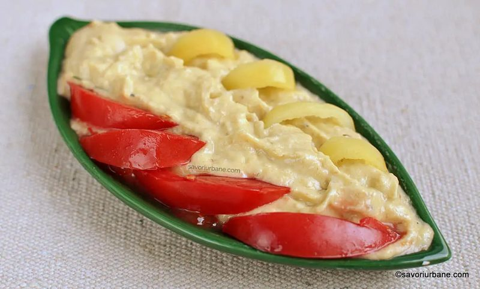
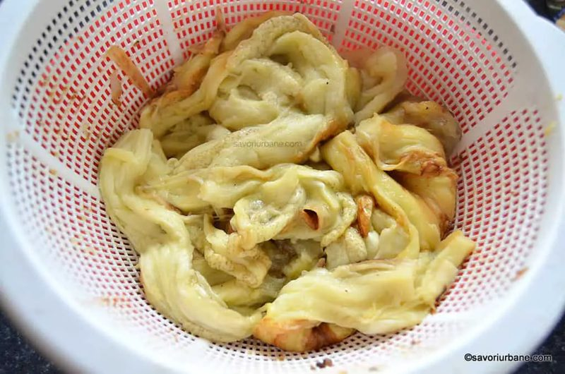
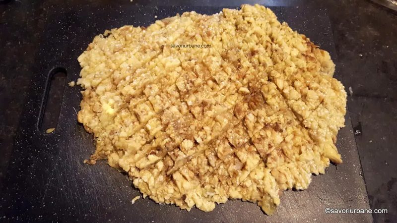
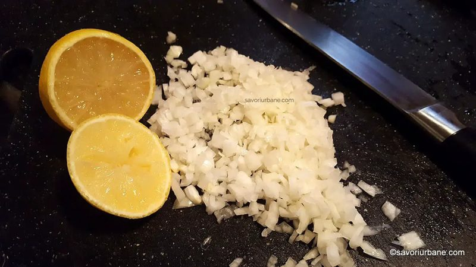
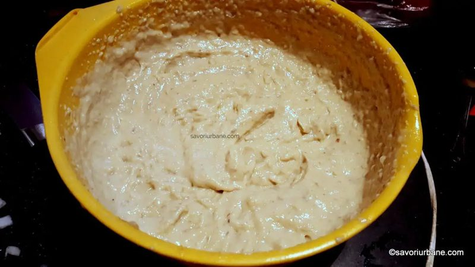
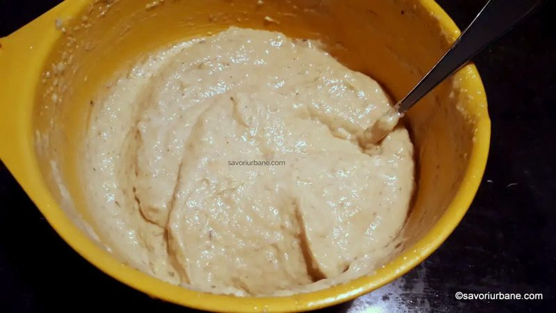

# Salată de vinete cu maioneză 🍆
*Rețeta românească tradițională*

*Foto: [Savori Urbane](https://savoriurbane.com/salata-de-vinete-cu-maioneza-reteta-romaneasca-traditionala/)*

> **Sursa:** rețeta de bază și pozele vin de la [Savori Urbane](https://savoriurbane.com/salata-de-vinete-cu-maioneza-reteta-romaneasca-traditionala/) (5,0 din 9 recenzii), verificată pe alte patru site-uri românești. Gălbenușurile se amestecă direct în vinete, deci nu faci o maioneză separată.

## Povestea
- **Originile:** După autoarea de la Savori Urbane, salata are origini orientale (turcești, arăbești) și a fost adaptată gusturilor de aici. Rudele ei din alte părți folosesc tahini și ulei de măsline (baba ghanoush) sau usturoi și ardei copt.
- **Cum a evoluat:** Versiunea clasică de vară e doar vinete, ulei, ceapă și lămâie sau un strop de oțet. Versiunea cu maioneză a venit mai târziu și, cum spune autoarea, e „spornică": gălbenușurile fac o emulsie stabilă care ia cu până la circa 50% mai mult ulei decât salata simplă. În bucătăriile vechi românești vinetele se tocau cu ustensile de lemn, pentru că cuțitele din oțel simplu le înnegreau.
- **Curiozitate:** Autoarea spune că la ea acasă salata cu maioneză se face doar iarna, din vinete coapte și congelate, care sunt mai negre și mai apoase. Vara mănâncă salata simplă, care iese albă și cremoasă oricum.

## Sfaturile bunicii 👵
- **Coace vinetele pe flacără deschisă** (aragaz sau grătar). Coaja se carbonizează, iar miezul rămâne alb, pufos și aromat; vinetele coapte în cuptor sau opărite n-au aroma aceea de ars. *Tradiție* (autoarea, care a învățat de la mama ei; [Savori Urbane](https://savoriurbane.com/salata-de-vinete-cu-maioneza-reteta-romaneasca-traditionala/)).
- **Curăță-le încă fierbinți,** ca miezul să rămână cât mai alb. *Confirmat* ([Adevărul](https://adevarul.ro/stiri-locale/oradea/cum-sa-gatesti-cea-mai-gustoasa-salata-de-vinete-1724295.html), [Jamila Cuisine](https://jamilacuisine.ro/salata-de-vinete-cu-maioneza-cremoasa-si-gustoasa-reteta-video/)).
- **Lasă miezul la scurs 2–3 ore** într-o strecurătoare; iese multă zeamă. *Confirmat* (Savori Urbane, [Laura Laurențiu](https://www.lauralaurentiu.ro/retete-culinare/retete-diverse/salata-de-vinete-romaneasca.html)).
- **Înțeapă cojile cu o furculiță înainte de copt,** ca aburul și lichidul să iasă. *Tradiție* (Laura Laurențiu).
- **Toacă cu un cuțit lung din inox sau cu o ustensilă de lemn, nu cu roboțelul,** care strică textura. *Tradiție* (Laura Laurențiu).
- **Pune întâi lămâia și sarea peste gălbenușuri:** ajută la deschiderea culorii salatei. *Sfatul autoarei* (Savori Urbane).
- **Nu folosi ulei de măsline:** e prea greu și schimbă gustul. Ia ulei de floarea-soarelui. *Sfatul autoarei* (Savori Urbane).
- **Dacă are gust amar,** zdrobește vinetele pe un tocător cu o lingură de lemn, sară-le și înclină tocătorul ca să curgă zeama amară. *Tradiție* (Adevărul).
- **Dacă ceapa crudă te deranjează,** clătește scurt ceapa tocată sub jet de apă rece. *Sfatul autoarei* (Savori Urbane).

**Porții** 10 · **Pregătire** 60 min · **Copt** 30 min · **Scurgere** 2–3 h · **Răcire** 1–2 h · **Mediu**

> **Înainte să începi:** vinetele trebuie să se scurgă 2–3 ore, așa că coace-le din timp. Ai nevoie de o strecurătoare din plastic și de un mixer de mână cu palete (nu blender).

## Pregătirea ingredientelor
- [ ] Spală 1,5–1,7 kg vinete (negre, lucioase, bombate)
- [ ] Toacă mărunt 1 ceapă mică (sau zdrobește 2–3 căței de usturoi)
- [ ] Taie lămâia
- [ ] Măsoară **150 ml** ulei de floarea-soarelui într-o cană; îl vei folosi în porții mici
- [ ] Separă **3 gălbenușuri proaspete**

## Ingrediente
- [ ] 1,5–1,7 kg vinete proaspete (cam 850 g de miez după copt și scurs)
- [ ] 3 gălbenușuri proaspete (1 gălbenuș la 300 g de vinete coapte și scurse)
- [ ] 150–200 ml ulei de floarea-soarelui
- [ ] Zeama de la cam ½ lămâie (cam 2 lingurițe la început, apoi după gust)
- [ ] Sare (cam 2 prize bune la început, apoi după gust)
- [ ] 1 ceapă mică tocată fin **sau** 2–3 căței de usturoi zdrobiți
- [ ] Pentru servire: roșii, ardei sau ceapă verde tocată, și pâine

## Pași
1. [ ] **Coace** **1,5–1,7 kg vinete** direct pe flacără deschisă (aragaz sau grătar), întorcându-le, până când coaja e carbonizată și miezul foarte moale. *Înțeapă mai întâi cojile cu o furculiță.*
   ⏱ **30 min** — *coaja neagră și crăpată, miezul se prăbușește.*
2. [ ] **Curăță-le încă fierbinți** de coajă și pune miezul într-o strecurătoare din plastic.
3. [ ] **Lasă-le la scurs.** *Cântărește miezul după aceea: ar trebui să ai cam **850 g**.*
   ⏱ **3 h** — *scurge 2–3 ore; iese multă zeamă.*

   
   *Scurgerea vinetelor coapte · Foto: [Savori Urbane](https://savoriurbane.com/salata-de-vinete-cu-maioneza-reteta-romaneasca-traditionala/)*

4. [ ] **Toacă** miezul scurs mărunt, pe un tocător mare, cu un cuțit lung din inox. *Nu cu roboțelul.*

   
   *Toacă mărunt cu cuțitul · Foto: [Savori Urbane](https://savoriurbane.com/salata-de-vinete-cu-maioneza-reteta-romaneasca-traditionala/)*

5. [ ] Toacă foarte mărunt **1 ceapă mică** (sau zdrobește **2–3 căței de usturoi**) și taie **lămâia**. *Dacă ceapa crudă te deranjează, clătește-o scurt sub apă rece.*

   
   *Ceapa și lămâia pregătite · Foto: [Savori Urbane](https://savoriurbane.com/salata-de-vinete-cu-maioneza-reteta-romaneasca-traditionala/)*

6. [ ] Pune **850 g de vinete tocate** într-un bol încăpător. Adaugă **3 gălbenușuri**, apoi stoarce **cam 2 lingurițe de zeamă de lămâie** și pune **2 prize bune de sare** direct peste gălbenușuri.

   
   *Gălbenușurile, lămâia și sarea intră primele · Foto: [Savori Urbane](https://savoriurbane.com/salata-de-vinete-cu-maioneza-reteta-romaneasca-traditionala/)*

7. [ ] Mixează cu un **mixer de mână cu palete sau tel (nu blender)**, adăugând treptat **150 ml ulei de floarea-soarelui**, în porții mici. *Maioneza se formează odată cu salata. Nu pune tot uleiul deodată; salata asta îl bea cu poftă, deci rămâi la cei 150 ml măsurați (cel mult 200 ml).*
   ⏱ **2 min** — *1–2 minute, nu mai mult; compoziția se face deschisă la culoare și pufoasă.*

   
   *Deschisă la culoare și pufoasă · Foto: [Savori Urbane](https://savoriurbane.com/salata-de-vinete-cu-maioneza-reteta-romaneasca-traditionala/)*

8. [ ] Amestecă cu o lingură **ceapa tocată** (sau **usturoiul zdrobit**). Gustă și corectează **sarea și lămâia**.

   
   *Cremoasă, albă și aromată · Foto: [Savori Urbane](https://savoriurbane.com/salata-de-vinete-cu-maioneza-reteta-romaneasca-traditionala/)*

9. [ ] Mut-o într-un recipient cu capac și **dă-o la rece**. Devine mai cremoasă și mai legată. Servește-o decorată cu roșii, ardei sau ceapă verde tocată, cu pâine.
   ⏱ **2 h** — *cel puțin 1 oră ([Gustos](https://www.gustos.ro/retete-culinare/salata-de-vinete-cu-maioneza-13.html)); 1–2 ore e mai bine.*

   
   *Servită pe pâine proaspătă cu roșii de vară · Foto: [Savori Urbane](https://savoriurbane.com/salata-de-vinete-cu-maioneza-reteta-romaneasca-traditionala/)*

## Cronometre – pe scurt
| Pas | Timp | Ce urmărești |
|---|---|---|
| Copt pe flacără | 30 min | Coajă carbonizată, miez prăbușit |
| Scurgere | 2–3 h | Rămân cam 850 g de miez |
| Mixat cu ulei | 1–2 min | Deschisă la culoare, pufoasă, cremoasă |
| Răcire | 1–2 h | Mai cremoasă și mai legată |

## Dacă ceva nu merge
- **Grasă, uleioasă:** prea mult ulei. Măsoară mai întâi 150 ml; salata îl absoarbe lacom.
- **Apoasă:** scurge mai mult (2–3 ore) și toacă abia după scurgere.
- **Închisă la culoare sau cenușie:** curăță vinetele fierbinți, evită cuțitele din oțel simplu și pune lămâia și sarea de la început.
- **Amară:** zdrobește pe tocător cu o lingură de lemn, sară și înclină ca să curgă zeama (Adevărul).
- **Nu e cremoasă:** folosește palete la mixer (nu blender) și adaugă uleiul în porții mici.
- **Fadă:** sare și lămâie, câte puțin.

## Servire, păstrare, reîncălzire
Se servește rece, decorată cu roșii și ardei, pe pâine proaspătă. Se ține acoperită la frigider; e bună și a doua zi, scoasă rece din frigider. Conține **gălbenușuri crude**: folosește ouă foarte proaspete, ține-o la rece și mănânc-o în 1–2 zile *(sfat obișnuit; autoarea notează că gălbenușurile crude sunt perisabile și că această variantă se potrivește mai bine iarna decât în zilele fierbinți de vară)*.

---

## Listă de cumpărături
- [ ] **Legume:** vinete 1,5–1,7 kg, 1 ceapă mică (sau usturoi), 1 lămâie, roșii și ardei sau ceapă verde pentru servire
- [ ] **Lactate și ouă:** 3 ouă proaspete (pentru gălbenușuri)
- [ ] **Cămară:** ulei de floarea-soarelui (200 ml), sare, pâine

## Echipament
Aragaz sau grătar pentru vinete, strecurătoare din plastic, cuțit lung din inox, tocător mare, bol încăpător, mixer de mână cu palete sau tel.

## Surse comparate
Baza: [Savori Urbane](https://savoriurbane.com/salata-de-vinete-cu-maioneza-reteta-romaneasca-traditionala/) (850 g miez, 3 gălbenușuri, 150–200 ml ulei, scurgere 2–3 h). Verificări: [Jamila Cuisine](https://jamilacuisine.ro/salata-de-vinete-cu-maioneza-cremoasa-si-gustoasa-reteta-video/) (maioneză separată, cuptor 200 °C 40–50 min, răcire câteva ore), [Laura Laurențiu](https://www.lauralaurentiu.ro/retete-culinare/retete-diverse/salata-de-vinete-romaneasca.html) (înțepat cojile, fără roboțel, variantă cu gălbenuș și muștar), [Gustos](https://www.gustos.ro/retete-culinare/salata-de-vinete-cu-maioneza-13.html) (1,5 kg vinete dau 750 g, 200 ml ulei, răcire 1 h) și [Adevărul](https://adevarul.ro/stiri-locale/oradea/cum-sa-gatesti-cea-mai-gustoasa-salata-de-vinete-1724295.html) (curățat fierbinți, remediu pentru amar). Celelalte fac o **maioneză separată** cu ou întreg sau gălbenuș și muștar; rețeta asta sare peste muștar și amestecă gălbenușurile direct. Cantitățile de ulei diferă (cam 60 ml la 2 vinete, până la 200 ml la 750–850 g), așa că urmez cei 150 ml din rețeta de bază.

## Variante
- **Varianta simplă de vară (fără maioneză):** doar ulei, ceapă tocată și lămâie sau un strop de oțet.
- **Cu maioneză separată:** fă-o din gălbenuș, muștar, ulei și lămâie, apoi încorporeaz-o (Jamila, Gustos).
- **Usturoi în loc de ceapă:** 2–3 căței zdrobiți.
