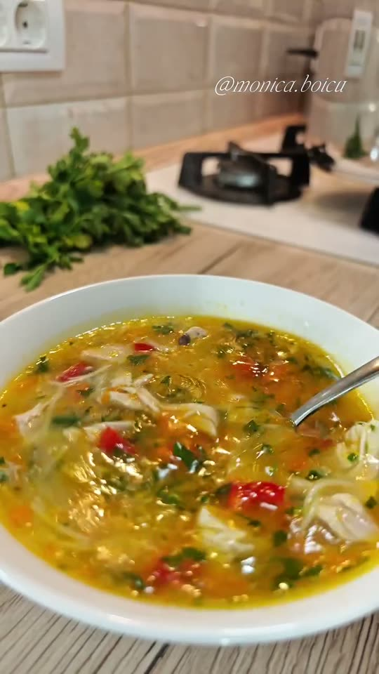
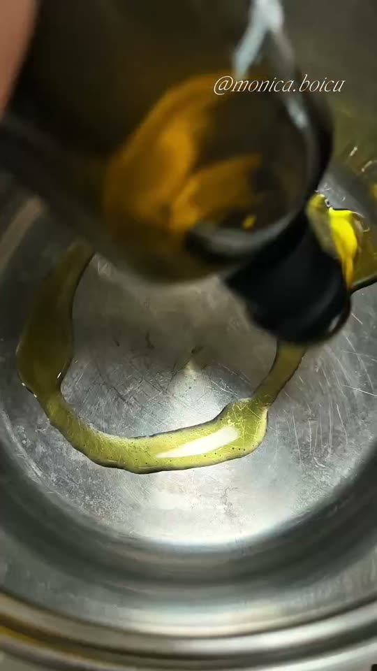
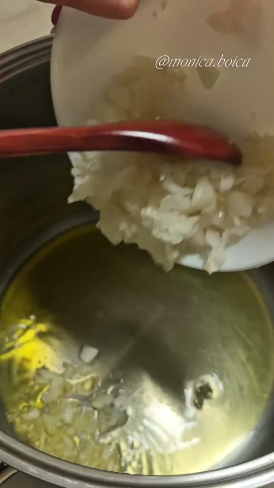
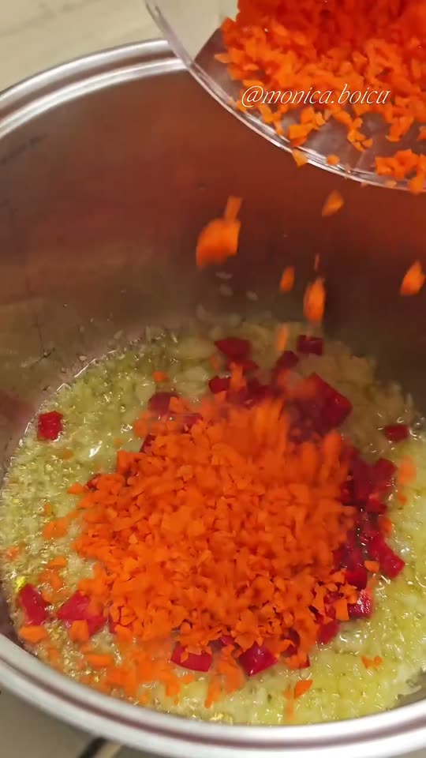
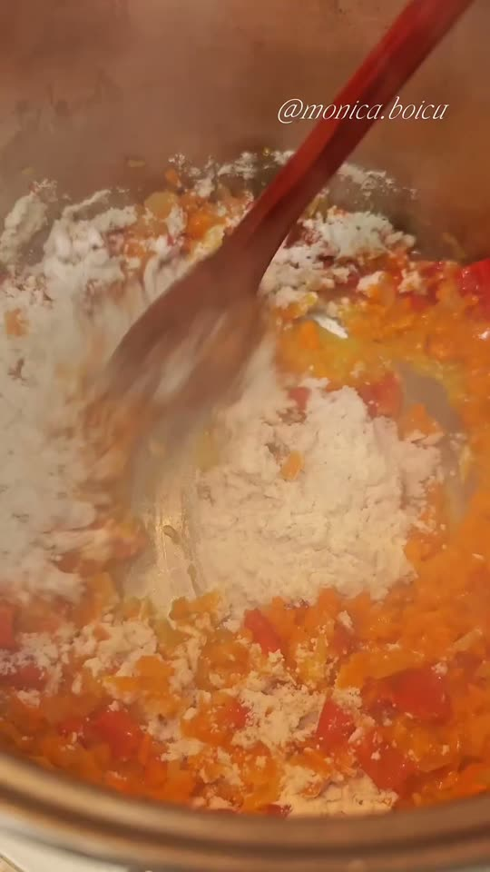
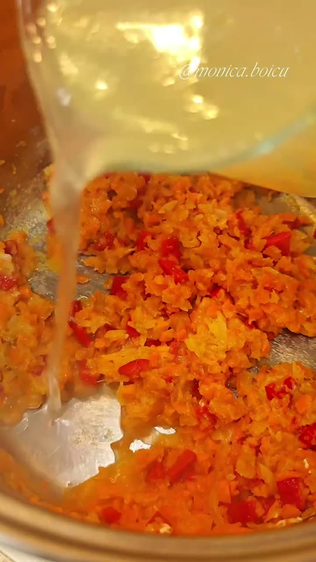
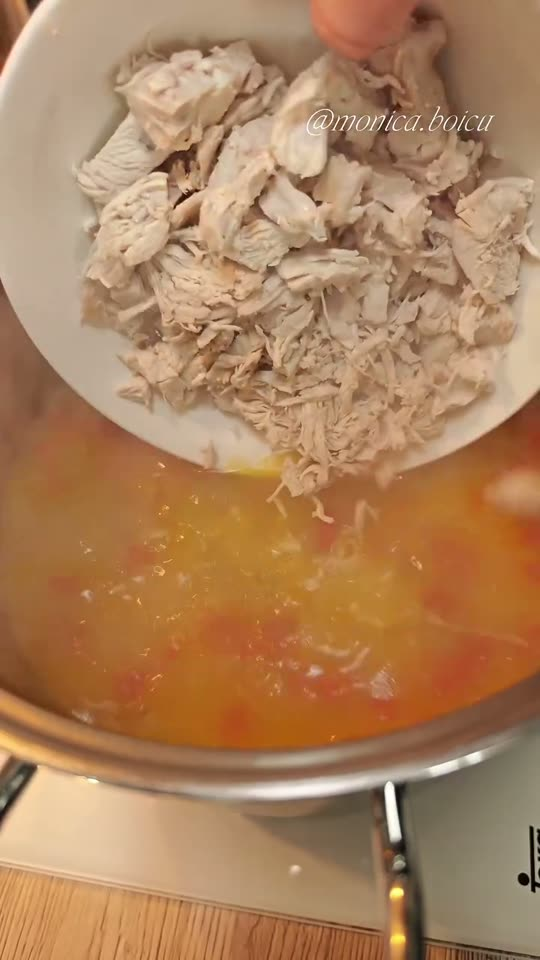
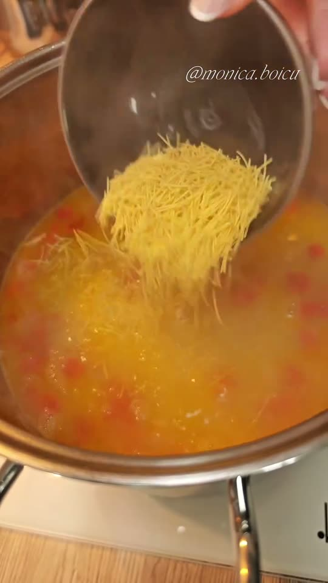
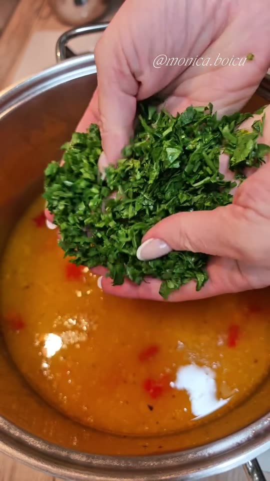
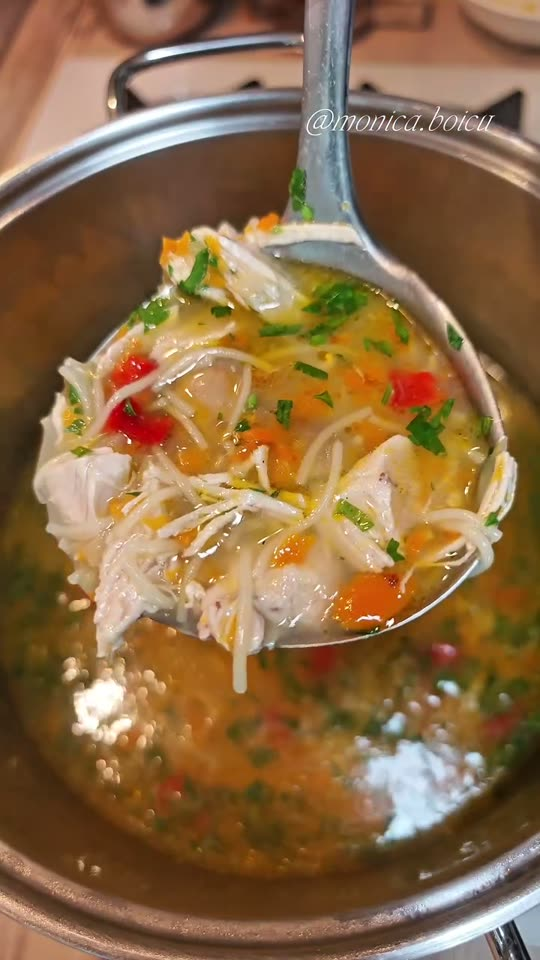

# Chicken Soup with Vegetables and Vermicelli 🍲
*Supa pe care o fac când vin virozele* ("the soup I make when colds arrive")

*Photo: frame from the [reel by Monica Boicu](https://www.facebook.com/reel/1790438665338604)*

> **Source and a warning about amounts:** this is the method from the reel by **Monica Boicu** (@monica.boicu). The video is only music, with no speech and **no on-screen text or amounts**, and the caption gives no recipe. So I took the **order of steps and the ingredients from the frames** (the video is deleted), and the **amounts are my *typical* values** from Romanian chicken-soup recipes (Gustos, csid.ro, Laura Laurențiu). If you need her exact amounts, she may share them in her comments or on Instagram. I could not tell what the pale liquid at 27 seconds is (possibly lemon juice), so I left it out.

## The story
- **Origins:** Chicken soup with homemade noodles is described by Romanian sites as one of the most loved dishes of traditional Romanian home cooking, bringing back family meals and childhood smells ([csid.ro](https://www.csid.ro/diete/retete-culinare/supa-de-pui-cu-taitei-de-casa-reteta-traditionala-gustoasa-si-usor-de-facut-21062693/)). The thickening step in this reel uses a *rântaș*: flour browned in fat, a word that comes from Hungarian *rántás* and is typical in Transylvania and Maramureș ([DEX](https://dexonline.ro/definitie/rântaș)).
- **How it evolved:** The classic Romanian *supă de pui* is a **clear** broth: the chicken simmers gently in cold water, the foam is skimmed, the whole vegetables are taken out and the *fidea* (thin noodles) cook in the strained broth. Monica Boicu's version keeps the vegetables in, **sautés them in oil and thickens them with flour** before adding broth, shredded chicken and vermicelli, so the soup is warmer and thicker.
- **Fun fact:** In her caption she says no dish "stops" viruses, but that balanced meals, enough protein, vegetables, fluids and rest support the body. The reel was viewed about 86,000 times.

## Romanian cooks' tips 👵
*I found no named grandmother for this dish, so these are tips from Romanian recipe sites and the reel itself.*
- **Start the chicken in cold water and simmer gently, never at a hard boil,** for a clear broth. *Confirmed* ([Laura Laurențiu](https://www.lauralaurentiu.ro/retete-culinare/supe-ciorbe/supa-de-pui-cu-galuste.html), [csid.ro](https://www.csid.ro/diete/retete-culinare/supa-de-pui-cu-taitei-de-casa-reteta-traditionala-gustoasa-si-usor-de-facut-21062693/)).
- **Skim the foam 3–4 times.** It is coagulated protein: not dirty, but it clouds the soup. *Confirmed* (Laura Laurențiu).
- **Salt lightly, then adjust at the end.** Gustos salts about 5 minutes before the end; Laura Laurențiu adds 1 teaspoon early and adjusts after straining. *Both agree on adjusting at the end* ([Gustos](https://www.gustos.ro/retete-culinare/supa-de-pui-cu-fidea-scurta-baneasa.html), Laura Laurențiu).
- **The vermicelli take 2–10 minutes depending on thickness;** add them when the soup is almost ready. For the clearest soup cook them separately for 1–2 minutes first. *Confirmed* (csid.ro).
- **Cook noodles only for the portions you serve:** Gustos strains the broth and cooks the *fidea* in just the amount of broth being served. *Tradition* (Gustos).
- **Finish with fresh parsley and cover the pot for a few minutes** so the aroma develops. *Confirmed* (csid.ro).
- **The reel's own trick:** sauté the onion, red pepper and carrot first, then stir in the flour so the soup gets body.

**Serves** 6 · **Prep** 20 min · **Cook** about 1 h 20 · **Easy**

> **Before you start:** in the reel the broth and the shredded chicken **are already made** (a jug of broth and a bowl of chicken appear). If you don't have them, make them first (steps 1–2).

## Mise en place
- [ ] Wash **1 kg chicken pieces** (thighs, drumsticks, breast)
- [ ] Peel and chop **1 onion**; dice **1 small red bell pepper**; finely grate or chop **2 carrots**
- [ ] Measure **2 tbsp flour** and **3 tbsp olive oil**
- [ ] Measure **70 g fine vermicelli (fidea)**
- [ ] Wash and chop a **handful of parsley**

## Ingredients
**Chicken broth (not shown in the reel)**
- [ ] 1 kg chicken pieces, with bones
- [ ] 2.5 L cold water
- [ ] Salt to taste

**Soup**
- [ ] About 2 L of the chicken broth, hot
- [ ] 300–400 g cooked chicken, shredded *(typical)*
- [ ] 3 tbsp olive oil *(typical)*
- [ ] 1 onion, chopped *(typical)*
- [ ] 1 small red bell pepper, diced (about 120 g) *(typical)*
- [ ] 2 carrots, finely grated or chopped (about 200 g) *(typical)*
- [ ] 2 tbsp plain flour *(my estimate; the reel shows a few spoonfuls)*
- [ ] 70 g fine vermicelli (*fidea*) *(typical)*
- [ ] A handful of fresh parsley, chopped
- [ ] Salt and pepper

## Steps
**The chicken and broth (made earlier in the reel)**
1. [ ] Put **1 kg chicken** in a pot with **2.5 L cold water**. Bring to the boil over medium heat, **skim the foam 3–4 times**, then lower to a very gentle simmer.
   ⏱ **1 h** — *chicken tender, broth clear.* *(Laura Laurențiu says 1–1.5 h)*
2. [ ] Lift the chicken out, strain the broth (keep about **2 L**, hot) and **shred the meat** off the bones. Salt the broth lightly.

**The soup (the reel)**
3. [ ] Pour **3 tbsp olive oil** into a clean pot over medium heat.

   
   *Start with the oil · Photo: [Monica Boicu reel](https://www.facebook.com/reel/1790438665338604)*

4. [ ] Add the **chopped onion** and the **diced red pepper** and cook until the onion turns translucent.
   ⏱ **5 min** — *onion soft and translucent, not browned.* *(typical)*

   
   *Onion first, then the red pepper · Photo: [Monica Boicu reel](https://www.facebook.com/reel/1790438665338604)*

5. [ ] Add the **2 grated carrots** and stir.

   
   *The carrots go in with the pepper and onion · Photo: [Monica Boicu reel](https://www.facebook.com/reel/1790438665338604)*

6. [ ] Sprinkle in **2 tbsp flour** and stir for a minute so it coats the vegetables (a light *rântaș*).
   ⏱ **1 min** — *no dry flour left, nothing browning.* *(typical)*

   
   *Flour stirred into the vegetables · Photo: [Monica Boicu reel](https://www.facebook.com/reel/1790438665338604)*

7. [ ] Pour in the **hot chicken broth** (about **2 L**) gradually, stirring, and bring to a gentle boil.
   ⏱ **10 min** — *vegetables tender, soup slightly thickened.* *(typical)*

   
   *Add the hot broth gradually · Photo: [Monica Boicu reel](https://www.facebook.com/reel/1790438665338604)*

8. [ ] Add the **shredded chicken** (300–400 g).

   
   *The shredded chicken goes in · Photo: [Monica Boicu reel](https://www.facebook.com/reel/1790438665338604)*

9. [ ] Add **70 g fine vermicelli** and cook until tender. *Check the packet: fine fidea needs only 2–5 minutes.*
   ⏱ **4 min** — *vermicelli soft but not mushy.* *(typical)*

   
   *The fidea go in last · Photo: [Monica Boicu reel](https://www.facebook.com/reel/1790438665338604)*

10. [ ] Turn off the heat, stir in a **handful of chopped parsley**, taste, and adjust the **salt and pepper**. Cover the pot for a few minutes.
    ⏱ **5 min** — *covered, off the heat.* *(csid.ro: "a few minutes")*

    
    *Fresh parsley at the end · Photo: [Monica Boicu reel](https://www.facebook.com/reel/1790438665338604)*

11. [ ] Serve hot, with plenty of chicken and vermicelli in each bowl.

    
    *Serve hot · Photo: [Monica Boicu reel](https://www.facebook.com/reel/1790438665338604)*

## Timer cheat-sheet
| Step | Time | Look for |
|---|---|---|
| Chicken and broth | 1 h | Tender chicken, clear broth |
| Onion and pepper | 5 min | Translucent |
| Flour | 1 min | No dry flour |
| Simmer with broth | 10 min | Slightly thickened |
| Vermicelli | 4 min | Soft, not mushy |
| Rest, covered | 5 min | Aroma develops |

## If it goes wrong
- **Cloudy broth:** the chicken boiled hard or the foam wasn't skimmed. Simmer gently and skim 3–4 times.
- **Lumpy soup:** add the broth gradually and stir after the flour goes in.
- **Mushy vermicelli:** add them last and don't overcook; cook them separately if you will keep leftovers.
- **Too thick:** add hot water or broth.
- **Bland:** salt at the end, a little at a time, and more parsley.

## Serve, store, reheat
Serve hot. Keep the soup in the fridge for 2–3 days *(typical)*; the vermicelli soak up broth, so add a little hot water when reheating, or cook the vermicelli separately for leftovers.

---

## Grocery list
- [ ] **Meat:** chicken pieces 1 kg
- [ ] **Produce:** 1 onion, 1 small red bell pepper, 2 carrots, parsley
- [ ] **Pantry:** olive oil, plain flour, fine vermicelli (*fidea*) 70 g, salt, pepper

## Equipment
Large pot for the broth, a second pot (or the same one, cleaned) for the soup, skimmer, wooden spoon, ladle.

## Sources compared
The method comes from the [reel by Monica Boicu](https://www.facebook.com/reel/1790438665338604): I downloaded the public video, found no speech or text (only music), and read the 16 frames (every 2 seconds). All amounts are *typical* values: [Gustos](https://www.gustos.ro/retete-culinare/supa-de-pui-cu-fidea-scurta-baneasa.html) (1.8 kg chicken, 2 L water, 3 carrots, ½ red bell pepper), [csid.ro](https://www.csid.ro/diete/retete-culinare/supa-de-pui-cu-taitei-de-casa-reteta-traditionala-gustoasa-si-usor-de-facut-21062693/) (2–3 L water, 2–3 carrots, noodles 2–10 min) and [Laura Laurențiu](https://www.lauralaurentiu.ro/retete-culinare/supe-ciorbe/supa-de-pui-cu-galuste.html) (skim 3–4 times, 1–1.5 h, 2–2.5 L water per kg). None of these Romanian recipes thickens the soup with flour; that is the reel's own step, so the flour amount is my estimate. The [DEX](https://dexonline.ro/definitie/rântaș) entry for *rântaș* gave the word's origin.

## Variants
- **Classic clear soup:** keep the vegetables whole, strain the broth and cook only the vermicelli in it (Gustos).
- **With homemade noodles** instead of vermicelli (csid.ro, Laura Laurențiu).
- **With lemon:** the reel may add something pale and sour at the end; a squeeze of lemon is a typical finish, but I could not confirm it.
