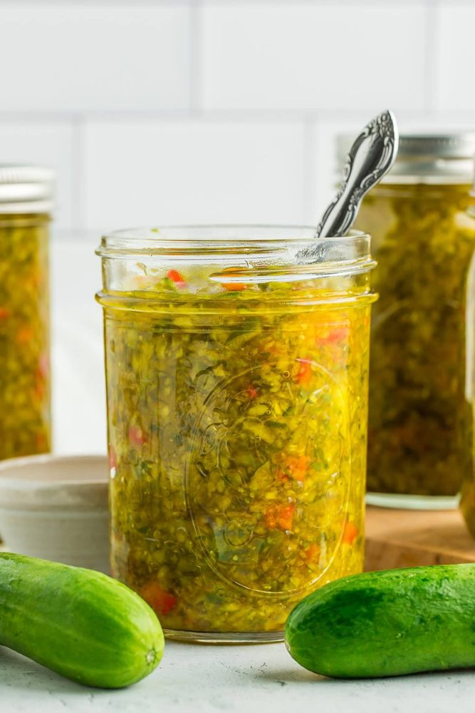
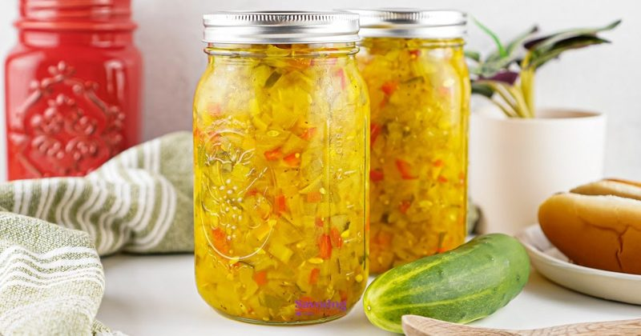

# Sweet pickle relish (relish de castraveți murați dulci) 🥒
*Condimentul dulce-acrișor de castraveți tocați mărunt, care intră în sosul de burger, în sosul tartar și pe hot dog*

*Foto: [Savoring The Good](https://www.savoringthegood.com/sweet-relish/)*

> **De ce această rețetă:** [Sosul de burger](recipe:burger-sauce) și [burgerul în stil Big Mac](recipe:big-mac-style-burger) au nevoie de sweet pickle relish, greu de găsit în multe magazine. Aceasta este o porție mică, la frigider, redusă din rețete testate. Pentru o variantă care se păstrează la temperatura camerei vezi secțiunea de conservare de la final.

## Povestea
- **Originile:** Un relish este un preparat gătit și murat din legume, fructe sau ierburi tocate, folosit drept condiment. În America de Nord cuvântul înseamnă de obicei un singur lucru: castravete murat tocat mărunt, în variante dulci, cu mărar sau simple, celebru pe hot dog ([Wikipedia](https://en.wikipedia.org/wiki/Relish)). Balcanii au o rudă în *kyopolou*, un relish din ardei roșii, vinete și usturoi.
- **Cum a evoluat:** Varianta dulce este cea folosită în sosurile americane de burger (vezi [Sosul de burger](recipe:burger-sauce)). Metoda testată de conservare vine din *Complete Guide to Home Canning* al USDA (Agriculture Information Bulletin 539, revizuit în 2015), pe care o publică National Center for Home Food Preservation ([NCHFP](https://nchfp.uga.edu/how/pickle/relishes/pickle-relish/)).
- **Curiozitate:** Culoarea relish-ului se schimbă după culoarea castraveților folosiți, deci două porții nu arată niciodată la fel ([Savoring The Good](https://www.savoringthegood.com/sweet-relish/)).

## Sfaturile celui care face conserve 🫙
*Pentru relish n-am găsit o tradiție de bunici, deci acestea sunt sfaturi din surse americane.*
- **Sărează legumele, lasă-le la înmuiat, apoi clătește-le și stoarce-le bine.** Așa iese apa din ele și relish-ul nu e apos. *Confirmat* ([Sustainable Cooks](https://www.sustainablecooks.com/sweet-pickle-relish/), [Savoring The Good](https://www.savoringthegood.com/sweet-relish/); NCHFP sărează și lasă la înmuiat tot).
- **Folosește oțet cu aciditate de 5% și nu micșora cantitatea de oțet.** *Confirmat* ([NCHFP](https://nchfp.uga.edu/how/pickle/relishes/pickle-relish/), rezumat de căutare pentru partea cu „nu micșora").
- **Scoate semințele din castraveții care au multe** și alege ardei mai dulci (roșii), dacă poți. *Sfaturile autoarei* (Savoring The Good).
- **Așteaptă 3 zile înainte de folosire** pentru cel mai bun gust. *Confirmat* (Savoring The Good; Sustainable Cooks așteaptă o săptămână pentru borcanele conservate).
- **Leagă mirodeniile întregi într-un săculeț,** ca să le poți scoate. *Confirmat* (NCHFP).
- **Folosește sare de murat sau de conserve** (toate cele trei surse o folosesc). *Confirmat.*
- **În sosul de burger folosește-l scurs,** iar un strop din zeama relish-ului poate înlocui „zeama de murături dulci". *Sugestia mea, pe baza sfatului cu zeama din rețetele de sos.*

**Iese** cam 2½ căni (600 ml) · **Pregătire** 20 min · **Înmuiere** 3 h · **Gătire** 15 min · **Ușor**

> **Înainte să începi:** este un relish de frigider, nu se păstrează la temperatura camerei. Îți trebuie un bol mare, o strecurătoare și borcane curate cu capac.

## Pregătirea ingredientelor
- [ ] **4 castraveți medii pentru murat** (cam 400 g), spălați
- [ ] **½ ardei gras roșu și ½ ardei gras verde** (cam 150 g)
- [ ] **½ ceapă albă mare** (cam 80 g)
- [ ] **2½ linguri (cam 45 g) sare de murat**
- [ ] **1¼ căni (300 ml) oțet de mere**, aciditate 5%, și **¾ cană (150 g) zahăr**
- [ ] **1 linguriță semințe de muștar, ½ linguriță semințe de țelină, ½ linguriță turmeric pudră**
- [ ] Opțional: 3 cuișoare întregi și 3 boabe de ienibahar într-un săculeț sau o bilă pentru ceai
- [ ] Borcan(e) curat(e), cu capac

## Ingrediente (cam 2½ căni)
**Legume (4 căni tăiate mărunt)**
- [ ] 4 castraveți medii pentru murat (cam 400 g, 2½ căni tăiate cubulețe)
- [ ] ½ ardei gras roșu și ½ ardei gras verde (1 cană tăiată cubulețe)
- [ ] ½ ceapă albă mare (½ cană tăiată cubulețe)

**Înmuiere**
- [ ] 2½ linguri (cam 45 g) sare de murat sau de conserve
- [ ] Apă rece și o mână de cuburi de gheață, cât să acopere

**Saramura**
- [ ] 1¼ căni (300 ml) oțet de mere (aciditate 5%); merge și oțet alb
- [ ] ¾ cană (150 g) zahăr
- [ ] 1 linguriță semințe de muștar
- [ ] ½ linguriță semințe de țelină
- [ ] ½ linguriță turmeric pudră
- [ ] Opțional: 3 cuișoare întregi și 3 boabe de ienibahar

## Pași
1. [ ] **Tăierea:** taie în două pe lung **cei 4 castraveți** și scoate semințele dacă sunt multe; curăță de semințe **ardeii**. Taie cubulețe foarte mici (cam 3 mm, ca să meargă la sosul de burger) castraveții, **½ ardei roșu și ½ verde** și **½ ceapă**. Ar trebui să ai cam **4 căni**.
2. [ ] **Sărarea:** pune legumele într-un bol mare, presară **2½ linguri de sare de murat** și amestecă. Acoperă cu apă rece și o mână de gheață și lasă la înmuiat.
   ⏱ **3 h** — *sursele le înmoaie 2–4 ore.*
3. [ ] **Clătirea și stoarcerea:** toarnă legumele într-o strecurătoare, **clătește-le bine sub apă rece**, scurge-le, apoi stoarce cât poți de mult lichid cu mâinile curate sau cu o cârpă. *Dacă sari peste pasul ăsta, relish-ul iese apos.*
4. [ ] **Saramura:** într-o oală, adu la fiert **1¼ căni de oțet** și **¾ cană de zahăr**, amestecând până se topește zahărul. Adaugă **1 linguriță semințe de muștar**, **½ linguriță semințe de țelină**, **½ linguriță turmeric** (și săculețul cu mirodenii) și fierbe scurt.
   ⏱ **2 min** — *zahărul topit, mirodeniile își lasă aroma.*
5. [ ] **Fierberea:** adaugă legumele scurse, amestecă bine și fierbe la foc mic, amestecând din când în când.
   ⏱ **10 min** — *legumele îmbrăcate și puțin moi, cu un pic de crocant.*
6. [ ] **Răcirea:** ia oala de pe foc, scoate săculețul cu mirodenii și lasă relish-ul să se răcească la temperatura camerei.
   ⏱ **2 h** — *la temperatura camerei.*
7. [ ] **La borcan și la frigider:** pune relish-ul cu saramura în borcane curate, închide-le și dă-le la frigider. Pentru cel mai bun gust așteaptă **3 zile** înainte să-l folosești.
8. [ ] **Folosirea:** pentru sosul de burger ia **2 linguri (30 ml)** de relish, scurs.

## Cronometre – pe scurt
| Pas | Timp | Ce urmărești |
|---|---|---|
| Înmuiere în sare | 3 h | Apa a ieșit din legume |
| Saramura | 2 min | Zahăr topit |
| Fierbere | 10 min | Ușor înmuiat, încă crocant |
| Răcire | 2 h | Temperatura camerei |
| Se așază la frigider | 3 zile | Aromele se leagă |

## Dacă ceva nu merge
- **Relish apos:** legumele nu au fost stoarse bine după clătire. Scurge-l pe o sită înainte de folosire.
- **Prea sărat:** data viitoare clătește legumele mai mult.
- **Prea ascuțit:** se îndulcește după 3 zile; pune puțin mai mult zahăr la porția următoare.
- **Culoare tristă:** depinde de castraveți și de ardei (Savoring The Good); ardeii roșii sau galbeni în loc de cei verzi dau un borcan mai viu.
- **Moale:** tăietură prea măruntă sau fiert prea mult; rămâi la 10 minute.

## Servire, păstrare, reîncălzire
Păstrează-l **la frigider**, într-un borcan curat și închis. Savoring The Good spune până la **3 luni** la frigider. O sursă de murături rapide din rezumatul meu de căutare spunea cam 2 săptămâni pentru murăturile de frigider, deci sursele nu se pun de acord; eu l-aș folosi în **1 lună** *(sfat obișnuit)* și l-aș arunca la primul semn de mucegai, miros neplăcut sau bucăți vâscoase. Folosește-l în sosul de burger, în sosul tartar, în salată de cartofi sau de ouă, sau pe hot dog.

---

## Listă de cumpărături
- [ ] **Legume:** 4 castraveți pentru murat (cam 400 g), 1 ardei gras (½ roșu și ½ verde; sau 1 mic roșu și 1 mic verde), ½ ceapă albă mare
- [ ] **Cămară:** sare de murat (45 g), oțet de mere 5% (300 ml), zahăr (150 g), semințe de muștar, semințe de țelină, turmeric pudră; opțional cuișoare întregi și ienibahar

## Echipament
Bol mare, strecurătoare, oală, 2–3 borcane curate cu capac, cuțit ascuțit (sau robot de bucătărie, pulsat în porții).

## Surse comparate
Baza: [Savoring The Good](https://www.savoringthegood.com/sweet-relish/) (metode la frigider și pentru conserve). Referința sigură pentru conserve este [NCHFP, Pickle Relish](https://nchfp.uga.edu/how/pickle/relishes/pickle-relish/), iar [Sustainable Cooks](https://www.sustainablecooks.com/sweet-pickle-relish/) e o variantă conservată. Le-am adus pe toate trei la o porție de 4 căni, calculând pe cană de legume:

| | Legume | Oțet | Zahăr | Sare | Înmuiere |
|---|---|---|---|---|---|
| NCHFP | 19 căni | 6 căni alb (0,32 pe cană) | 2 căni (0,11) | ¾ cană (0,04) | 4 h + 1 h în apă cu gheață |
| Sustainable Cooks | 12½ căni | 4½ căni (0,36) | 2½ căni (0,20) | ⅔ cană (0,05) | 3 h |
| Savoring The Good | cam 7 căni (estimat) | 1¼ căni (cam 0,18) | 1½ căni (cam 0,21) | ¼ cană (cam 0,04) | 2 h |

Medianele au dat 1¼ căni de oțet, ¾ cană de zahăr și 2½ linguri de sare la 4 căni de legume. Volumul de legume al porției Savoring The Good este estimarea mea (6 castraveți medii, 2 ardei și 1 ceapă mare). Wikipedia a fost folosită pentru definiție. Allrecipes și Serious Eats nu pot fi accesate de unealta mea de căutare, așa că nu le-am folosit.

## Variante
**Relish pentru conserve (se păstrează la temperatura camerei):** **nu** o reduce. Folosește rețeta testată a National Center for Home Food Preservation exact cum e scrisă ([NCHFP](https://nchfp.uga.edu/how/pickle/relishes/pickle-relish/)). Iese cam 9 pinte: 3 qt de castraveți tăiați, câte 3 căni de ardei gras verde și roșu tăiați, 1 cană de ceapă tăiată, ¾ cană sare de conserve sau de murat, 4 căni de gheață, 8 căni de apă, 2 căni de zahăr, câte 4 lingurițe de semințe de muștar, turmeric, ienibahar întreg și cuișoare întregi și 6 căni de oțet alb (5%). Înmoaie legumele 4 ore în apa sărată cu gheață, scurge-le, acoperă-le cu apă proaspătă cu gheață încă 1 oră, scurge din nou. Adu la fiert mirodeniile (într-un săculeț), zahărul și oțetul și toarnă peste legume, acoperă și ține 24 de ore la frigider. Apoi adu la fiert, umple fierbinte borcane curate lăsând ½ inch spațiu liber și procesează borcanele fierbinți de jumătate de pintă sau de pintă într-o oală de conservare cu apă clocotită **10 minute (0–1.000 ft)**, **15 minute (1.001–6.000 ft)** sau **20 de minute (peste 6.000 ft)**. Citește mai întâi ghidul NCHFP despre oalele de conservare cu apă clocotită.

*Relish conservat · Foto: [Sustainable Cooks](https://www.sustainablecooks.com/sweet-pickle-relish/)*

- **Picant:** adaugă unul-doi ardei jalapeño tăiați cubulețe (sugestie dintr-un rezumat de căutare).
- **Mai ascuțit:** folosește oțet alb în loc de oțet de mere (NCHFP și Sustainable Cooks o fac).
- **Fără timp:** taie mărunt castraveți murați dulci (cornișoni dulci) și folosește-i în loc de relish (Taste of Home face asta în [sosul lui de burger](recipe:burger-sauce)).
